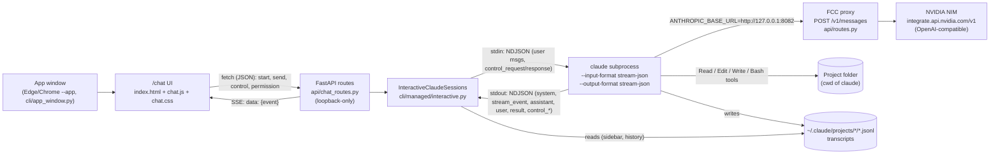

# Recreating a Claude-Desktop-style coding app on top of Claude Code

A teaching guide to the `/chat` app that ships with Free Claude Code (FCC). It
shows how a desktop coding app, similar in spirit to the **Code** tab of the
Claude desktop app, can be built around the real Claude Code CLI and pointed
at free or open model APIs such as NVIDIA NIM through the FCC proxy.

> **Unofficial project.** FCC and this chat app are independent open-source
> work. They are not affiliated with, endorsed by, or supported by Anthropic.
> Claude and Claude Code are trademarks of Anthropic. The app does not copy or
> reverse-engineer the Claude desktop app. It drives the public `claude` CLI
> through its documented stream-json and permission protocol.

---

## 1. What it is

The app has three parts:

1. **A web UI** (`/chat`): a sidebar with past chats, a message thread,
   a composer, and permission and plan cards. It is plain HTML, CSS, and
   JavaScript with no framework and no CDN.
2. **A small FastAPI backend** that starts one long-lived `claude` process per
   chat and relays its JSON events to the browser over Server-Sent Events (SSE).
3. **The FCC proxy**, which receives Claude Code's Anthropic-style
   `/v1/messages` calls and sends them to the provider and model you chose,
   for example a Kimi, Nemotron, or GLM model hosted on NVIDIA NIM.

The app does not reimplement tools. File reads, edits, shell commands, MCP
servers, skills, slash commands, subagents, and plan mode all come from the
real Claude Code CLI. The app only decides **how to show** Claude Code's events
and **how to answer** its questions, such as "may I run this command?".

On top of plain chat, the app adds a **verified execution workbench** (section
5). **Verified** and **Parallel** run modes check Claude's work against real
evidence before calling it done. Session settings add permission presets and
budgets, and Admin gains views for key pools, usage, secrets, audit, and
policy. The full reference is [workbench.md](workbench.md).

---

## 2. Architecture



The same flow as plain text:

```
App window ──► /chat UI ──fetch──► FastAPI /chat/api/* ──► InteractiveClaudeSessions
                  ▲                                            │  stdin  (NDJSON)
                  └─────────── SSE (text/event-stream) ◄───────┤  stdout (NDJSON)
                                                               ▼
                                                     `claude` subprocess (cwd = your folder)
                                                               │ HTTP /v1/messages
                                                               ▼
                                                     FCC proxy ──► NVIDIA NIM (or another provider)
```

Key wiring:

- `runtime/application.py` creates one `InteractiveClaudeSessions` with
  `proxy_target=self._proxy_target` and
  `app_sessions_path=~/.fcc/chat-sessions.json`. `runtime/bootstrap.py` passes
  it to the API as `services.chat`, typed as `ChatRuntimePort` in
  `api/ports.py`.
- `InteractiveClaudeSessions.start()` builds the argv with
  `build_interactive_claude_argv()` and the environment with
  `build_managed_claude_env()` (`cli/managed/claude.py`). That environment sets
  `ANTHROPIC_BASE_URL` to the local proxy, `ANTHROPIC_AUTH_TOKEN`, and
  `CLAUDE_CODE_ENABLE_GATEWAY_MODEL_DISCOVERY=1` (see `cli/claude_env.py`). It
  also turns off telemetry, the auto-updater, and error reporting. As a result,
  **every model call from `claude` goes to FCC, never to Anthropic.**

### The exact command line

From `build_interactive_claude_argv()`:

```
claude --input-format stream-json --output-format stream-json --verbose \
       --include-partial-messages --permission-prompt-tool stdio \
       --permission-mode <mode> --allow-dangerously-skip-permissions \
       [--model <id>] [--resume <session_id>]
```

| Flag | Why it is there |
|---|---|
| `--input-format stream-json` | The process stays alive and reads one JSON message per line from stdin, so a chat is one process across many turns. |
| `--output-format stream-json --verbose` | Every event (init, assistant message, tool result, final result) is written as one JSON line on stdout. |
| `--include-partial-messages` | Adds `stream_event` lines with token-by-token deltas, which gives the typing effect. |
| `--permission-prompt-tool stdio` | Permission questions arrive as `control_request` lines on stdout and are answered on stdin instead of in a terminal prompt. |
| `--allow-dangerously-skip-permissions` | Only *allows* a later switch to `bypassPermissions`. It does not turn that mode on. |

Official references: [Run Claude Code programmatically (headless / stream-json)](https://code.claude.com/docs/en/headless),
[Configure permissions](https://code.claude.com/docs/en/agent-sdk/permissions),
[Handle approvals and user input](https://code.claude.com/docs/en/agent-sdk/user-input).
In short: stream-json output is newline-delimited JSON that ends with a
`result` message. Partial messages arrive as `stream_event` lines. Permission
checks run in this order: hooks, deny rules, ask rules, permission mode, allow
rules, and finally your "can use tool" handler. That handler returns
`{behavior: "allow", updatedInput}` or `{behavior: "deny", message}`.

---

## 3. One turn, step by step

The JSON lines below are shortened. Real events carry more fields, such as
`uuid`, `usage`, and full tool lists. The shapes match what
`InteractiveClaudeSession` writes and what `chat.js` reads.

**1. The UI opens a session.** `newChat()` in `chat.js` sends
`POST /chat/api/live` with `{cwd, permission_mode, model, resume_session_id}`.
This warms a process before the first prompt. The server spawns `claude` and
returns `snapshot()`. The UI then opens
`EventSource("/chat/api/live/<live_id>/events")`.

**2. The backend sends `initialize`.** `InteractiveClaudeSession._initialize()`
calls `control({"subtype": "initialize"})`. Request ids have the form
`fcc_<n>`.

```json
{"type":"control_request","request_id":"fcc_1","request":{"subtype":"initialize"}}
```

Claude Code replies on stdout. `_resolve_control()` matches the reply to the
pending future:

```json
{"type":"control_response","response":{"subtype":"success","request_id":"fcc_1",
 "response":{"commands":[{"name":"compact","description":"Compact conversation"}],
             "models":[{"value":"anthropic/nvidia_nim/<publisher>/<model>","displayName":"..."}]}}}
```

The backend republishes the reply as the synthetic event
`{"type":"fcc_initialize","response":{...}}`. The UI uses it to fill the `/`
command menu and to provide a fallback model list.

**3. Claude Code reports `system/init`.** `_handle_event()` copies
`session_id`, `permissionMode`, and `model` into the session and publishes
`fcc_state`:

```json
{"type":"system","subtype":"init","session_id":"1b2c...","permissionMode":"default","model":"anthropic/nvidia_nim/<publisher>/<model>","slash_commands":["compact","review"]}
```

**4. The user sends a prompt.** The UI sends
`POST /chat/api/live/<id>/messages` with `{"content": "Add a --verbose flag to cli.py"}`.
`send_user_message()` first publishes
`{"type":"fcc_user","message":{...}}`, so every open window shows the prompt
immediately. It then writes to stdin:

```json
{"type":"user","message":{"role":"user","content":"Add a --verbose flag to cli.py"},"parent_tool_use_id":null,"session_id":"1b2c..."}
```

`content` can also be a list of blocks. Pasted or dropped images are sent as
`{"type":"image","source":{"type":"base64","media_type":"image/png","data":"..."}}`
blocks followed by a `text` block.

**5. Tokens stream in.** The UI receives `stream_event` lines. They are *not*
stored in the replay log (`_UNBUFFERED_TYPES`), because the final `assistant`
message replaces them.

```json
{"type":"stream_event","event":{"type":"message_start","message":{"id":"msg_01"}}}
{"type":"stream_event","event":{"type":"content_block_start","index":0,"content_block":{"type":"text","text":""}}}
{"type":"stream_event","event":{"type":"content_block_delta","index":0,"delta":{"type":"text_delta","text":"I'll open cli.py"}}}
{"type":"stream_event","event":{"type":"content_block_stop","index":0}}
```

`handleStreamEvent()` creates a prose node, or a collapsible "Thinking" node
for `thinking` blocks, per content block. It re-renders the Markdown at most
once per animation frame (`scheduleProse()`).

**6. The complete assistant message arrives, with a tool call.**

```json
{"type":"assistant","parent_tool_use_id":null,"message":{"id":"msg_01","content":[
  {"type":"text","text":"I'll open cli.py and add the flag."},
  {"type":"tool_use","id":"toolu_01","name":"Edit","input":{"file_path":"C:\\proj\\cli.py","old_string":"parser = ...","new_string":"parser = ...\nparser.add_argument('--verbose')"}}]}}
```

`renderAssistant()` swaps the streamed text for the final text through
`claimStreamed()`. `renderToolUse()` draws a tool card. For `Edit`, the card
shows a red and green diff built by `diffNode()`.

**7. Claude Code asks for permission.** The mode is `default` and `Edit` is not
pre-approved, so Claude Code sends a `can_use_tool` control request.
`_handle_inbound_control()` records the id in `_open_permission_ids` and
publishes the request unchanged:

```json
{"type":"control_request","request_id":"a1b2","request":{"subtype":"can_use_tool","tool_name":"Edit",
 "input":{"file_path":"C:\\proj\\cli.py","old_string":"...","new_string":"..."},
 "permission_suggestions":[{"type":"setMode","mode":"acceptEdits","destination":"session"}]}}
```

`renderPermission()` shows an "Allow Edit?" card with **Allow once**,
**Always allow** (shown only when `permission_suggestions` is present),
**Deny**, and a feedback box.

**8. The user clicks Allow once.** The UI sends
`POST /chat/api/live/<id>/permissions/a1b2` with
`{"decision":{"behavior":"allow","updatedInput":{...same input...}}}`. The
route accepts only `allow` or `deny`. `respond_permission()` writes:

```json
{"type":"control_response","response":{"subtype":"success","request_id":"a1b2",
 "response":{"behavior":"allow","updatedInput":{"file_path":"C:\\proj\\cli.py","old_string":"...","new_string":"..."}}}}
```

It then publishes `{"type":"fcc_permission_resolved","request_id":"a1b2","behavior":"allow"}`
so that every open window marks the card as resolved. A deny looks like this:
`{"behavior":"deny","message":"Use argparse's store_true instead"}`. Claude
reads the message and changes its approach.

**9. Claude Code runs the tool and reports the result.** The result comes back
as a `user` message:

```json
{"type":"user","message":{"role":"user","content":[{"type":"tool_result","tool_use_id":"toolu_01","content":"The file C:\\proj\\cli.py has been updated."}]}}
```

`renderToolResults()` marks the card as ok or error and appends the output. For
`Edit`, `Write`, `MultiEdit`, and `NotebookEdit` it also records the file in
the **Changes** pane (`recordChange()`).

**10. The turn ends.**

```json
{"type":"result","subtype":"success","is_error":false,"duration_ms":8123,"num_turns":3,"result":"Added --verbose.","usage":{"output_tokens":412},"session_id":"1b2c..."}
```

`_handle_event()` sets `busy = False` and publishes `fcc_state`. The UI removes
"Working…", prints `8.1s · 3 turns · 412 output tokens`, and calls
`refreshContext()`. That sends a `get_context_usage` control request so the
context chip can show `NN% context`.

### Other control requests the UI can send

`POST /chat/api/live/<id>/control` forwards only the subtypes in
`_UI_CONTROL_SUBTYPES`: `interrupt`, `set_permission_mode`, `set_model`,
`set_max_thinking_tokens`, `mcp_status`, and `get_context_usage`. The server
owns `initialize`. After a successful `set_permission_mode` or `set_model`,
`control()` updates the session snapshot and publishes `fcc_state`.

| UI action | Control request |
|---|---|
| Stop button / Esc | `{"subtype":"interrupt"}`. The turn ends with `result` subtype `error_during_execution`, which the UI shows as "Interrupted". |
| Mode menu / Shift+Tab | `{"subtype":"set_permission_mode","mode":"acceptEdits"}` |
| Model menu | `{"subtype":"set_model","model":"anthropic/nvidia_nim/<publisher>/<model>"}` (`"default"` = let FCC route `MODEL`) |
| After each result | `{"subtype":"get_context_usage"}` |

Claude Code can also send control requests *to* the app, for example hook
callbacks. This app registers no hooks and no in-process MCP servers, so
`_handle_inbound_control()` answers every non-`can_use_tool` request with
`{"subtype":"error", ...}` straight away. Claude Code is never left waiting.

### Synthetic `fcc_*` events

The backend adds a few events of its own to the stream:

| Event | Meaning |
|---|---|
| `fcc_state` | Session snapshot: `live_id`, `session_id`, `cwd`, `model`, `permission_mode`, `busy`, `exited`, `has_messages` |
| `fcc_initialize` | The `initialize` reply (commands, models) |
| `fcc_user` | Echo of a user prompt (also produced when a saved transcript is loaded) |
| `fcc_permission_resolved` | A permission card was answered, or Claude Code cancelled it (`control_cancel_request`) |
| `fcc_replay_end` | End of the replay backlog. Live events follow. |
| `fcc_raw` | A stdout line that was not valid JSON |
| `fcc_exit` | The process exited: `{code, stderr}` (last 8,000 characters of stderr) |
| `fcc_task`, `fcc_intent`, `fcc_checkpoint`, `fcc_verification_started`, `fcc_verification_check`, `fcc_verification`, `fcc_recovery`, `fcc_orchestration` | Verified and Parallel run progress (section 5, [workbench.md §2](workbench.md#2-task-lifecycle)) |
| `fcc_budget` | A session budget ran out and the turn was interrupted |
| `fcc_usage` | Token, request, and failover totals for this Claude session, after each result |
| `fcc_injection` | A tool result looked like a prompt injection; the tool card gets an **Injection?** badge |

The snapshot in `fcc_state` also carries `policy_preset`, `budget`, and
`usage` `{input_tokens, output_tokens, turns, elapsed_s}`.

### Replay, reconnects, and cleanup

- **Replay log.** Every event except `stream_event` is appended to
  `_events`. A new subscriber, for example a reloaded window, first receives
  the backlog, then `fcc_replay_end`, then live events. Past
  `MAX_REPLAY_EVENTS` (5,000) events, `_trim_events()` cuts the log to 4,000.
  It always keeps the latest `fcc_state` and `fcc_initialize`, and any
  permission requests that are still open.
- **Skipping the replay.** When the UI has already drawn a saved transcript
  from disk, it connects with `skipReplay`. Until `fcc_replay_end` it applies
  only state, init, and open prompts.
- **Reaping warm sessions.** When the last subscriber disconnects,
  `_reap_if_abandoned()` runs after `ABANDON_GRACE_S` (10 s). It closes the
  process only if no prompt was ever sent (`has_messages` is false). Chats in
  use keep running, and the sidebar shows them with a live dot.
- **Tracking app sessions.** `_remember_app_session()` saves session ids started
  from this UI to `~/.fcc/chat-sessions.json`. `list_transcripts()` marks them
  `"app": true`, so the sidebar can tell them apart from headless sessions that
  other tools create.
- **Shutdown.** `close()` closes stdin so `claude` can exit cleanly. After 5 s
  it kills the process tree with `kill_pid_tree_best_effort()`. Every PID is
  registered in `cli/process_registry.py`.
- **Stdout line limit.** Tool results can be large single lines, so the
  subprocess reader limit is raised to 64 MiB (`_STDOUT_LINE_LIMIT`).

### History and resume

`cli/managed/transcripts.py` reads the files that Claude Code itself writes to
`~/.claude/projects/<project>/<session_id>.jsonl` (or under
`$CLAUDE_CONFIG_DIR`):

- `list_transcripts()` returns the 200 most recent sessions that contain a real
  user prompt. It caches summaries by `(mtime, size)`. The title comes from
  `custom-title`, then `ai-title`, then `summary`, then the first prompt.
- `load_transcript_events()` converts saved entries into the same event shapes
  as the live stream (`assistant`, `user` tool results, `fcc_user`,
  `compact_boundary`). One renderer draws both live and saved chats.
- Rename appends a `{"type":"custom-title",...}` line. Delete removes the
  `.jsonl` file permanently.
- Continuing an old chat starts a new process with `--resume <session_id>`.

---

## 4. How direct file analysis and editing work

Claude Code runs **inside the folder you pick** (`cwd` of the subprocess). Its
own tools do all the work:

| Tool | What it does | How the UI shows it |
|---|---|---|
| `Read`, `Glob`, `Grep` | Read and search files | Collapsible card with the path or pattern |
| `Edit`, `MultiEdit`, `Write`, `NotebookEdit` | Change files | Diff card, plus an entry in the **Changes** pane |
| `Bash` / `PowerShell` | Run shell commands | `$ command` or `PS> command`, then the output |
| `Task` / `Agent` | Subagents | Nested card. Child events are linked through `parent_tool_use_id`. |
| `TodoWrite` | Task list | Checklist card and a sticky "todo dock" |
| `mcp__server__tool` | MCP tools | Shown as `server · tool` |

**@-mentions.** Typing `@cli` calls `GET /chat/api/files?cwd=...&q=cli`.
`project_files.search_project_files()` uses `git ls-files --cached --others --exclude-standard`
when the folder is a git work tree. Otherwise it walks the folder, skipping
dot-folders, `node_modules`, `.venv`, `dist`, `build`, and similar, up to
20,000 files. It returns at most 50 matches. The chosen path is inserted into
the prompt as text, and Claude Code resolves `@path` itself.

**Folder picker.** `GET /chat/api/dirs?path=...` calls
`project_files.list_directories()`. It lists visible subfolders, skipping
dotfiles and folders with the Windows hidden or system attribute, and on
Windows it adds drive roots. Changing folders starts a new chat in that folder.

### Permission modes

`PERMISSION_MODES` in `core/claude_permission_modes.py` is, least to most strict,
`("bypassPermissions", "auto", "acceptEdits", "default", "dontAsk", "plan")`:

| Mode | UI label | Behavior (summary of the official docs) |
|---|---|---|
| `default` | Ask permissions | Anything not pre-approved triggers a `can_use_tool` card. |
| `acceptEdits` | Auto-accept edits | File edits and basic filesystem commands inside the project are approved automatically. Other commands still ask. |
| `plan` | Plan mode | Claude explores and plans. Edits and file-changing shell commands are never auto-approved. |
| `auto` | Auto mode | A model classifier approves or denies instead of you. Availability depends on your Claude Code version and setup. |
| `bypassPermissions` | Bypass permissions | No prompts, apart from a few safety exceptions. **Dangerous.** |

Shift+Tab cycles through `default → acceptEdits → plan`. `renderControls()`
never saves `bypassPermissions` to `localStorage`, so a reload falls back to
`default`. Claude Code also has a `dontAsk` mode that this app does not offer.

### Plan approval (`ExitPlanMode`)

When Claude finishes a plan in plan mode, it calls the `ExitPlanMode` tool.
That call reaches the UI as a `can_use_tool` request. `buildPlanCard()` renders
`input.plan` as Markdown and offers three choices:

- **Yes, auto-accept edits** →
  `{"behavior":"allow","updatedInput":<input>,"updatedPermissions":[{"type":"setMode","mode":"acceptEdits","destination":"session"}]}`
- **Yes, approve each edit** → the same, with `"mode":"default"`
- **Keep planning** → `{"behavior":"deny","message":"<your feedback>"}`

### Clarifying questions (`AskUserQuestion`)

`AskUserQuestion` also arrives as `can_use_tool`. `buildQuestionCard()` shows
one radio group per question, or checkboxes when `multiSelect` is true, plus an
"Other…" text box. On submit, the UI returns the original input with an
`answers` map added. Each key is the question text, and each value is the
chosen label(s) joined with `", "`:

```json
{"behavior":"allow","updatedInput":{"questions":[...],"answers":{"Which test runner?":"pytest"}}}
```

**Skip** sends a deny: `"The user declined to answer."`

---

## 5. The verified workbench in the app

This section covers what you see in the UI. [workbench.md](workbench.md)
explains how each part works.

### Run modes: Chat, Verified, Parallel

The **run mode chip** next to the permission chip (`runModeBtn`,
`renderRunModeMenu()` in `chat.js`) chooses how the next message is sent. It
posts `POST /chat/api/live/<id>/messages` with
`{"content": ..., "mode": "normal"|"verified"|"parallel", "strategy": ...}`.
The choice is saved in `localStorage` (`fcc.runMode`, `fcc.strategy`).

| Mode | What happens |
|---|---|
| **Chat** (`normal`) | Unchanged: the prompt goes straight to Claude Code. |
| **Verified** | The prompt is compiled into an **intent contract** (MUST / MUST NOT / PRESERVE / scope). A **git checkpoint** is taken. Claude gets the prompt plus the contract. When it finishes, a **verification gate** runs the project's own typecheck, test, build, and lint commands, a secret scan, a scope check, and intent conformance. A failure produces a bounded **recovery** prompt (at most 3 tries per failure and 8 in total), then verification runs again. Only the gate can mark the task **Verified**. |
| **Parallel** | The request is split into a task graph of up to 6 nodes. Each node that edits files runs in its own git worktree and branch as a separate headless Claude Code session. The branches are merged in dependency order, and the gate checks the merged result. **Strategy** limits concurrency: Economy 1, Balanced 3, Fastest 6. The folder must be a clean git repo on a branch. |

If the contract is unclear (for example "delete the old data"), the task stops
in `BLOCKED_FOR_CLARIFICATION`. A **clarify card** then asks the questions and
posts the answers to `POST /chat/api/tasks/<id>/clarify`.

### Verification panel

The **Verification** button in the top bar (`verifyBtn`, `renderVerify()`)
opens a side panel with one section per task, newest first. Each section shows:

- a status pill and a disposition banner (**Verified**, **Failed
  verification**, or **Needs review**) with its blocking reasons,
- the locked contract (`contractNode()`), and for Parallel runs the task graph
  (`graphNode()`),
- every verification attempt with its checks (✓ passed, ✕ failed, ! advisory
  failure, – skipped), durations, exit codes, and output tails,
- the **gap matrix**: each requirement id (`M1`, `N1`, `P1`, `X1`) with its
  evidence and a status of covered, missing, or failed,
- a timeline of lifecycle events,
- the actions **Export evidence** (Markdown from
  `/chat/api/tasks/<id>/evidence`), **Revert task changes** (a scoped revert to
  the checkpoint, disabled outside git), and **Cancel task**.

Reopened chats load their earlier tasks from
`GET /chat/api/sessions/<session_id>/tasks` (`loadTaskHistory()`).

### Session settings: policy preset and budgets

The gear button next to the composer (`settingsBtn`, `renderSettings()`) sets
values that apply when the **next** session starts. An unused warm session
restarts right away (`applySettings()`).

- **Policy preset**: none, `restricted` (read-only), `workspace` (edit the
  project; network commands ask), or `privileged` (bypass mode, but the
  built-in ask/deny rules still apply). The menu lists each preset's rules from
  `GET /chat/api/policy/presets`. Every preset asks before reading `.env*` or
  key files, denies writes inside `.git`, asks before destructive commands and
  `git push`, and denies force push. See the
  [presets table](workbench.md#7-permission-presets).
- **Budgets**: max turns, max minutes of busy time, and max output tokens. When
  a limit is reached, the turn is interrupted and a "Stopped: … limit reached"
  notice appears (`renderBudget()`). The chat then refuses new messages.

### Endpoint health chip

If a provider has an API key pool, a small chip at the right of the composer bar, next to the context and model chips
(`healthChip`, `loadHealth()`, polled every 20 s from
`GET /chat/api/endpoints/summary`) shows, for example,
`NIM 1/2 keys healthy`. Its colour is green, amber (cooling down or circuit
open), or red (no healthy key). Clicking it opens Admin. Pools are configured
with `<KEY_ENV>S="label=key,..."`, for example
`NVIDIA_NIM_API_KEYS="work=nvapi-...,home=nvapi-..."`. A rate-limited key fails
over to another key before the first token streams.

### Admin views

`http://127.0.0.1:8082/admin` gains five views (`admin.js`, `admin_static/index.html`):

| View | Shows | API |
|---|---|---|
| **Endpoints** | Live health for each provider key: circuit, cooldown, failures, latency. Refreshes every 5 s, with a **Reset** button for each key. | `GET /admin/api/endpoints`, `POST /admin/api/endpoints/{provider}/{label}/reset` |
| **Usage** | Requests, errors, rate limits, p50/p95 latency, and tokens for each key and each session, plus recent attempts. Windows: 15 min to 7 days. | `GET /admin/api/usage?minutes=` |
| **Secrets** | Encrypted vault: save, list (names only), delete, and **Move keys** (migrate plaintext `*_API_KEY(S)` to `vault:` references). | `/admin/api/secrets*` |
| **Audit** | Hash-chained log of permission decisions, verifications, reverts, secret changes, and config applies, with a "Chain verified" or "Tampered at id N" pill. | `GET /admin/api/audit` |
| **Policy** | The compiled rules of each preset. | `GET /admin/api/policy/presets` |

---

## 6. Setup for students

### 6.1 Install FCC, uv, and the Claude Code CLI

Use the repository installer. It installs `uv` if needed, installs FCC, and
asks which coding agents to install. **Choose Claude Code.**

Windows PowerShell:

```powershell
& ([scriptblock]::Create((irm "https://raw.githubusercontent.com/Alishahryar1/free-claude-code/main/scripts/install.ps1")))
```

macOS / Linux:

```bash
curl -fsSL "https://raw.githubusercontent.com/Alishahryar1/free-claude-code/main/scripts/install.sh" | sh
```

Read [install.ps1](../scripts/install.ps1) and [install.sh](../scripts/install.sh)
before running them. Checking that a script is what you expect is a good habit
in its own right. Then check that `claude --version` works in a **new**
terminal. The chat backend looks up `claude` on `PATH` and reports an error if
it is missing.

### 6.2 Get an NVIDIA NIM API key

1. Sign in at [build.nvidia.com](https://build.nvidia.com) and create a key at
   [build.nvidia.com/settings/api-keys](https://build.nvidia.com/settings/api-keys).
2. Treat the key like a password. Never commit it or paste it into a chat.

### 6.3 Configure models in Admin

Start FCC (see 6.4) and open **http://127.0.0.1:8082/admin**. The default port
is `8082`. Change it with `PORT` in `~/.fcc/.env`.

1. Paste your key into **`NVIDIA_NIM_API_KEY`**. Optional: store it encrypted
   instead (**Secrets** view, or `fcc-secret set nvidia`) and enter
   `vault:nvidia` as the value. Add more keys for failover with
   `NVIDIA_NIM_API_KEYS="label1=key1,label2=key2"`
   ([workbench.md §10-11](workbench.md#10-credential-vault)).
2. Set **`MODEL`** (Default Model). Model references use the format
   `provider/model-id`, and for NVIDIA NIM that is
   `nvidia_nim/<publisher>/<model>`.
3. Optionally add more entries to **`CHAT_MODELS`** ("Chat Models"), a
   comma-separated list that sets the order of the `/chat` model picker.
   `MODEL`, the tier overrides (`MODEL_OPUS`, ...), and `MODEL_FALLBACKS` are
   always listed after these entries.
4. Click **Apply**.

To add Kimi, Nemotron, GLM, or other models, open the model catalog on
build.nvidia.com and copy the **exact** model id shown there. It has the form
`<publisher>/<model>`. Add the `nvidia_nim/` prefix:

```dotenv
MODEL="nvidia_nim/<publisher>/<model>"
CHAT_MODELS="nvidia_nim/<publisher-a>/<model-a>,nvidia_nim/<publisher-b>/<model-b>"
# Optional: try these, in order, when the chosen model fails before producing output
# MODEL_FALLBACKS="nvidia_nim/<publisher-c>/<model-c>"
```

Model ids in this guide are placeholders on purpose. NVIDIA's catalog changes
often, so copy the current ids yourself. Settings rejects duplicate entries in
`CHAT_MODELS` or `MODEL_FALLBACKS`.

**How ids reach the picker.** `GET /chat/api/models` calls
`build_chat_models_response()` in `api/model_catalog.py`. It walks
`chat_picker_model_refs()` (`config/model_refs.py`), which lists `CHAT_MODELS`
first and then the routing models, and turns each reference into a Claude Code
gateway id:

- `anthropic/<provider>/<model>`, for example `anthropic/nvidia_nim/<publisher>/<model>`
  (`gateway_model_id()`).
- `claude-3-freecc-no-thinking/<provider>/<model>` when FCC has learned the
  model does not support thinking (`no_thinking_gateway_model_id()`).

The entry that matches `MODEL` is flagged `default`. Picking it starts `claude`
with no `--model` flag, so FCC routes the request to `MODEL`.

### 6.4 Launch the app

Pick one:

- **Windows, from a repo checkout:** double-click `Claude-Desktop.bat`. It runs
  `Claude-Desktop.ps1` hidden. The script reads `PORT` from `~/.fcc/.env`,
  starts `uv run fcc-server` if `/chat` is not already responding, waits up to
  60 s, and opens Edge or Chrome as an app window (`--app=http://127.0.0.1:<port>/chat`)
  with its own profile in `~/.fcc/chat-window`.
- **Installed desktop shell (Windows/macOS):** run `fcc-desktop`, or open
  "Free Claude Code" from the Start menu or Applications. `cli/desktop.py`
  starts the server with a tray icon and calls `schedule_open_chat_window()`.
  The tray's default item **Open Claude** reopens the window, and
  **Providers & Models** opens Admin.
- **Any OS:** run `fcc-server`, then browse to
  **http://127.0.0.1:8082/chat**.
- **Windows, everything at once:** double-click `Start-All.bat` (repo root). It
  runs `Start-All.ps1`, which starts Ollama (`ollama serve`, port 11434) if it
  is installed, then an NVIDIA proxy at `~/.nvidia-proxy/proxy.py` (port 8787)
  if that file exists, then calls `Claude-Desktop.ps1` for the FCC server and
  the app window. Servers that are already listening are left alone.
  `Stop-All.bat` / `Stop-All.ps1` closes the app window (only browser processes
  that use the `~/.fcc/chat-window` profile), then kills the process tree that
  owns the FCC port (from `PORT` in `~/.fcc/.env`, default 8082), including its
  `claude` chat processes, plus any `fcc-server` or `fcc-desktop` process. It
  also stops whatever listens on 8787 and 11434 and the Ollama tray app. It
  stops them even if you started them yourself.

`cli/app_window.py` → `open_app_window()` looks for Edge or Chrome on Windows,
Chrome or Edge on macOS, and Chromium, Chrome, or Edge on Linux. It opens the
URL with `--app=` and `--user-data-dir=`, which gives a window without tabs or
an address bar and its own taskbar entry. If no such browser is found, it opens
a normal browser tab.

### 6.5 First chat

1. Click the folder chip and choose a small practice project.
2. Keep **Ask permissions** mode on.
3. Ask: *"Explain what this project does, then add a README section describing how to run it."*
4. Watch for the `Read`/`Glob` cards, the permission card for `Write`/`Edit`,
   and the **Changes** pane.

---

## 7. Feature map

| Claude desktop (Code tab) feature | This app | Where |
|---|---|---|
| Chat thread with streaming Markdown | Yes | `handleStreamEvent`, `markdown()` in `chat.js` |
| Extended thinking display | Collapsible "Thinking" | `thinkingNode()` |
| Pick a project folder | Folder dialog with recents and drives | `openFolderDialog`, `/chat/api/dirs` |
| Tool cards (read, edit diff, bash output) | Yes | `renderToolUse`, `toolInputNode`, `renderToolResults` |
| Permission prompts, including "always allow" | Yes | `buildToolPermissionCard` |
| Permission modes including plan mode | Yes, 5 modes, Shift+Tab cycles | `MODES`, `setMode` |
| Plan approval | Yes | `buildPlanCard` |
| Clarifying questions | Yes | `buildQuestionCard` |
| Model switcher | Yes, only models you configured | `renderModelMenu`, `/chat/api/models` |
| Slash commands (`/compact`, skills, custom) | Yes, from `initialize.commands` | `slashMatches` |
| `@file` mentions | Yes | `mentionQuery`, `/chat/api/files` |
| Image paste / drag-drop | Yes, images only | `addFiles` |
| Subagents | Nested cards | `parent_tool_use_id` handling |
| Todo list | Card and dock | `renderTodoDock` |
| Changed-files panel | Yes, per chat | `recordChange`, `renderChanges` |
| Context usage meter | Yes | `refreshContext`, `setContext` |
| Stop / interrupt | Yes (Esc) | `interrupt()` |
| Chat history, search, rename, delete | Yes, from `~/.claude/projects` | `transcripts.py`, sidebar |
| Resume a past chat | Yes (`--resume`) | `startLive()` |
| Several chats running at once | Yes (live dots) | `InteractiveClaudeSessions` |
| Light/dark theme, keyboard shortcuts | Yes (Ctrl+K search, Ctrl+Shift+O new chat) | `wire()` |
| Standalone window | Chromium `--app` window | `app_window.py`, `Claude-Desktop.ps1` |
| Provider retry notice | Yes (`system/api_retry`) | `handleSystem` |
| *FCC extras, not in the Claude desktop app:* | | |
| Verified run mode (intent contract, verification gate, bounded recovery) | Yes | `RUN_MODES`, `handleTaskEvent`; `workbench/coordinator.py` |
| Parallel run mode (task graph, worktrees, integration) | Yes | `applyOrchestration`, `graphNode`; `workbench/orchestration/` |
| Verification panel (checks, gap matrix, evidence export, revert) | Yes | `renderVerify`, `taskSection`, `taskActions` |
| Session settings (policy preset, budgets) | Yes | `renderSettings`, `applySettings`; `workbench/policy.py` |
| Endpoint health chip (multi-key pools) | Yes | `loadHealth`, `renderHealth`; `providers/key_pool.py` |
| Prompt-injection badge on tool output | Yes | `markInjection`; `workbench/injection.py` |
| Admin: Endpoints, Usage, Secrets, Audit, Policy | Yes | `admin.js`; `api/admin_routes.py` |
| One-click start/stop of all local servers | Windows | `Start-All.bat`, `Stop-All.bat` |

### What cannot be recreated

These features depend on Anthropic's accounts or cloud and are not part of the
local CLI:

- Signing in to claude.ai, subscription plans, usage limits, and billing.
- Cloud sessions, background agents on Anthropic infrastructure, and handoff
  between web, desktop, and mobile.
- claude.ai Projects, project knowledge, and memory stored in the cloud.
- Hosted connectors and integrations that are managed through a claude.ai
  account. Locally configured MCP servers still work, because Claude Code
  loads them.
- Artifacts hosting, sharing links, and team or enterprise administration.
- Native OS integration of the real desktop app, such as its own installer,
  auto-update, and native menus. This app is a browser window.
- Anthropic's own models. Every request goes to FCC and your chosen provider.
  Answer quality, tool-use reliability, and context size depend on that model,
  and free models are often weaker at long agentic tasks.

---

## 8. Security notes

- **Local only.** Every `/chat` route depends on `require_loopback_admin`
  (`api/admin_routes.py`) and `require_same_origin` (`api/chat_routes.py`). The
  client address and the `Host` header must be loopback, which blocks DNS
  rebinding. If an `Origin` header is present, it must match `Host` exactly,
  which stops other websites *and* pages on other localhost ports from driving
  the app from your browser. Requests *without* an `Origin` header (curl,
  scripts) from the same machine are still allowed.
- **The UI can run shell commands.** Anything that can reach `/chat/api/*` can
  start `claude` in any folder and approve its tool calls. Never expose the FCC
  port to a network, for example with `HOST=0.0.0.0` behind a public IP,
  a tunnel, or port forwarding.
- **Bypass mode.** `bypassPermissions` lets Claude edit and delete files and run
  commands without asking. Use it only in a throwaway folder or a VM. The UI
  does not save it as your default. Deny rules and hooks in Claude Code's
  settings still apply.
- **Permission request ids are checked.** `respond_permission()` answers only
  ids that are still in `_open_permission_ids`. The route accepts only
  `behavior` `allow` or `deny`. The UI cannot send arbitrary control requests;
  only the subtypes in `_UI_CONTROL_SUBTYPES` are forwarded.
- **No third-party scripts.** `index.html` loads only `/chat/assets/chat.css`
  and `/chat/assets/chat.js`. `chat_asset()` serves only the names in
  `_ASSETS`, so there is no path traversal and no CDN.
- **Escape-first Markdown.** Model output is untrusted. `markdown()` and
  `inline()` pass every text fragment through `esc()` *before* adding tags.
  Links are allowed only for `http(s)://` URLs, with
  `rel="noopener noreferrer"`. Other content goes through `textContent`, not
  `innerHTML`.
- **Session ids are validated** (`is_valid_session_id`: `[A-Za-z0-9_-]{8,64}`)
  before any transcript file lookup.
- **Your API key** stays in `~/.fcc/.env` on the server side. The browser never
  sees it. The `claude` subprocess gets only the local proxy URL and FCC's
  proxy token.
- **Repository content runs code.** Claude Code loads the project's
  `.claude/settings.json` hooks and `.mcp.json` servers. Only open folders you
  trust.
- **Verification runs code too.** Verified and Parallel runs execute the
  project's own test, build, lint, and typecheck commands, with no sandbox.
- **Policy presets are guard rails, not a sandbox.** Their command rules match
  the command text Claude writes, so `/bin/rm` or `sh -c "rm ..."` gets past
  `rm *`. Use a VM for untrusted work. See
  [workbench.md §16](workbench.md#16-security-notes-and-known-limitations) for
  the full list of limitations.
- **Secrets.** Keep keys in the vault (`fcc-secret set <name>`, then
  `KEY=vault:<name>` in `.env`) instead of in plaintext. `fcc-secret migrate`
  leaves a plaintext backup that you must delete yourself.

---

## 9. Exercises

Start easy and work up.

1. **Trace a turn.** Open DevTools → Network → the `events` request. Match
   each SSE line to a step in section 3. Then find the line in
   `interactive.py` that produced each `fcc_*` event.
2. **Add a slash-command button bar.** Add buttons for `/compact` and
   `/review` above the composer that put the command in the input and call
   `send()`. Use `state.commands` so a button appears only when the command
   exists.
3. **Render a new tool type.** `WebFetch` and `WebSearch` currently fall back to
   a JSON dump in `toolInputNode()`. Add a card showing the URL or query as a
   link, and a short preview of the result in `renderToolResults()`.
4. **Better diffs.** `diffNode()` prints all removed lines and then all added
   lines. Implement a real line diff, such as a small LCS, and write a test
   page for it.
5. **"Approve with changes".** For `Bash`, let the user edit the command in the
   permission card before allowing it, and send the edited command in
   `updatedInput`. Discuss when this is useful and when it is risky.
6. **Show MCP status.** Call the allowed `mcp_status` control request and show
   the connected MCP servers in a popover.
7. **Thinking budget control.** Add a UI control for
   `set_max_thinking_tokens`. It is already allowed by
   `_UI_CONTROL_SUBTYPES`.
8. **Add a provider.** Follow the "Choose A Provider" section of the
   [README](../README.md) and the existing adapters under
   `src/free_claude_code/providers/`. Configure a second provider, add its
   models to `CHAT_MODELS`, and compare the same task on two models.
9. **Security review.** Write a short threat model for section 8. What
   happens if another program on the machine calls `POST /chat/api/live`?
   Propose a mitigation, such as a per-launch token, and explain the
   trade-offs.
10. **Tests.** Read `tests/cli/fake_claude_stream.py`. It is a fake `claude`
    that speaks the protocol. Extend it and `tests/cli/test_interactive_chat.py`
    to cover `control_cancel_request`.

Workbench exercises (read [workbench.md](workbench.md) first):

11. **Break the gate on purpose.** In a small git project with a pytest suite,
    run a Verified task whose prompt says "don't touch `tests/`", and ask for a
    change that needs a test edit. Find the failed `N1` row in the gap matrix,
    then trace it in `verification/checks.py` (`_RULES`, `_evaluate()`,
    `gap_matrix()`). Explain why the disposition is `FAILED_VERIFICATION` and
    which `fcc_recovery` action follows (hint: `recovery.ASK_USER_CATEGORIES`).
12. **Stream check results live.** `fcc_verification_check` events are
    published only after `run_gate()` returns (see the `ponytail:` note in
    `TaskCoordinator._verify()`). Add a progress callback to `run_gate()`, emit
    each check as it finishes, and extend `tests/workbench/test_coordinator.py`.
13. **Better MUST evidence.** A MUST row counts as covered when *any* unit test
    passes. Design a mapping from requirements to specific tests (for example,
    tests whose names or changed lines mention the requirement's path tokens).
    Implement it in `gap_matrix()` and add edge-case tests in
    `tests/workbench/test_verification_checks.py`. Discuss false positives.
14. **Watch failover.** Configure `NVIDIA_NIM_API_KEYS` with two keys, one of
    them invalid on purpose. Send a prompt and watch the Admin **Endpoints**
    view (the bad key goes `OPEN` with `auth_failed`) and the **Usage** view
    (`failover_from`). Map what you see to `record_failure()` in
    `providers/endpoint_health.py`, then reset the key from Admin.
15. **Tamper with the audit log.** Stop FCC and copy `~/.fcc/fcc.db`. On the
    *copy*, drop the `audit_log_no_update` trigger and change one row's
    `outcome` with `sqlite3`. Open the copy with `AuditLog(Store(path))` and call
    `verify()`. Then delete the newest row instead and explain why `verify()`
    still returns `True`. Propose an external anchor, such as publishing the
    head hash, that would catch that.

---

## 10. File map

| File | Role |
|---|---|
| `src/free_claude_code/cli/managed/interactive.py` | `InteractiveClaudeSession` (one `claude` process, control protocol, replay log, `fcc_*` events), `InteractiveClaudeSessions` (registry, start/close, transcripts, file search), `build_interactive_claude_argv()` |
| `src/free_claude_code/cli/managed/transcripts.py` | Lists, loads, renames, and deletes Claude Code `.jsonl` transcripts |
| `src/free_claude_code/cli/managed/project_files.py` | `@`-mention file search (`git ls-files` or a walk) and the folder browser |
| `src/free_claude_code/cli/managed/claude.py` | `build_managed_claude_env()`: environment that points `claude` at the proxy |
| `src/free_claude_code/cli/claude_env.py` | `ANTHROPIC_BASE_URL`, `ANTHROPIC_AUTH_TOKEN`, gateway model discovery flags |
| `src/free_claude_code/api/chat_routes.py` | All `/chat` routes (page, assets, sessions, files, dirs, models, transcripts, live, events SSE, messages, control, permissions, tasks, policy presets, endpoint summary) and `require_same_origin` |
| `src/free_claude_code/api/ports.py` | `ChatRuntimePort` / `ChatSessionPort` / `WorkbenchPort` protocols the routes depend on |
| `src/free_claude_code/api/admin_routes.py` | `require_loopback_admin` (loopback client and Origin check); endpoints, usage, secrets, audit, and policy admin routes |
| `src/free_claude_code/api/model_catalog.py` | `build_chat_models_response()` for the model picker |
| `src/free_claude_code/core/gateway_model_ids.py` | `anthropic/<provider>/<model>` and no-thinking id encoding |
| `src/free_claude_code/config/settings.py` | `MODEL`, `MODEL_FALLBACKS`, `CHAT_MODELS`, `PORT` settings |
| `src/free_claude_code/config/model_refs.py` | `chat_picker_model_refs()`, `configured_chat_model_refs()` |
| `src/free_claude_code/config/admin/manifest.py` | Admin fields, including "Chat Models" |
| `src/free_claude_code/api/chat_static/index.html` | Page layout (sidebar, thread, composer, dialogs) |
| `src/free_claude_code/api/chat_static/chat.js` | Client: SSE, event rendering, Markdown, cards, menus, folder picker |
| `src/free_claude_code/api/chat_static/chat.css` | Styling and light/dark themes |
| `src/free_claude_code/runtime/application.py`, `runtime/bootstrap.py` | Create `InteractiveClaudeSessions`, the `Store`, the `EndpointPool`, and `WorkbenchService`; stop all sessions on shutdown |
| `src/free_claude_code/cli/app_window.py` | `open_app_window()`: Chromium `--app` window |
| `src/free_claude_code/cli/desktop.py`, `cli/desktop_tray.py` | Desktop shell and tray ("Open Claude", "Providers & Models") |
| `src/free_claude_code/cli/commands.py` | `open_chat_when_ready()`, `schedule_open_chat_window()` |
| `src/free_claude_code/config/server_urls.py` | `local_chat_url()` |
| `Claude-Desktop.bat`, `Claude-Desktop.ps1` | Windows one-click launcher from a repo checkout |
| `Start-All.bat`/`.ps1`, `Stop-All.bat`/`.ps1` | Start or stop Ollama, the NVIDIA proxy, the FCC server, and the app window together |
| `src/free_claude_code/workbench/coordinator.py` | `TaskCoordinator`: Verified and Parallel runs on a live chat session, `fcc_task`/`fcc_verification*` events |
| `src/free_claude_code/workbench/service.py` | `WorkbenchService` (tasks, secrets, audit, chat observer), `launch_policy()` |
| `src/free_claude_code/workbench/intent.py` | Intent contract compiler (`compile_intent`, `render_contract`) |
| `src/free_claude_code/workbench/verification/` | `profile.py` (project commands, check plan), `checks.py` (runners, gap matrix), `failures.py` (parsers, fingerprints), `gate.py` (`run_gate`, dispositions, evidence) |
| `src/free_claude_code/workbench/recovery.py` | Recovery ladder and recovery prompts |
| `src/free_claude_code/workbench/checkpoints.py` | Git snapshot checkpoints and scoped revert |
| `src/free_claude_code/workbench/tasks.py` | `TaskStore`: lifecycle, evidence, and events in SQLite |
| `src/free_claude_code/workbench/orchestration/` | Parallel mode: `planner.py`, `graph.py`, `leases.py`, `worktrees.py`, `runner.py`, `integration.py` |
| `src/free_claude_code/workbench/policy.py` | Permission presets compiled to `--settings` |
| `src/free_claude_code/workbench/audit.py`, `injection.py`, `memory.py`, `model_client.py` | Audit hash chain, injection scan, verified solution memory, helper model client |
| `src/free_claude_code/providers/key_pool.py`, `endpoint_health.py`, `usage_records.py` | Multi-key failover, circuit breaker, usage rows |
| `src/free_claude_code/config/provider_keys.py` | Parses `<KEY_ENV>S` key pools |
| `src/free_claude_code/core/vault.py`, `cli/secret_command.py`, `config/loader.py` | Credential vault, `fcc-secret`, `vault:<name>` resolution |
| `src/free_claude_code/core/storage.py` | Shared SQLite `Store` (`~/.fcc/fcc.db`) |
| `src/free_claude_code/api/admin_static/admin.js` | Admin UI, including the Endpoints, Usage, Secrets, Audit, and Policy views |
| `tests/workbench/` | Workbench tests, including the `fake_claude_coder.py` and `fake_claude_worker.py` fakes |
| `tests/cli/fake_claude_stream.py`, `tests/cli/test_interactive_chat.py`, `tests/api/test_chat_routes.py` | Protocol fake and tests |
