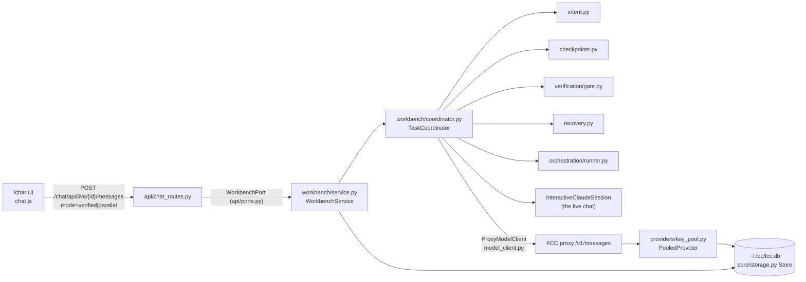
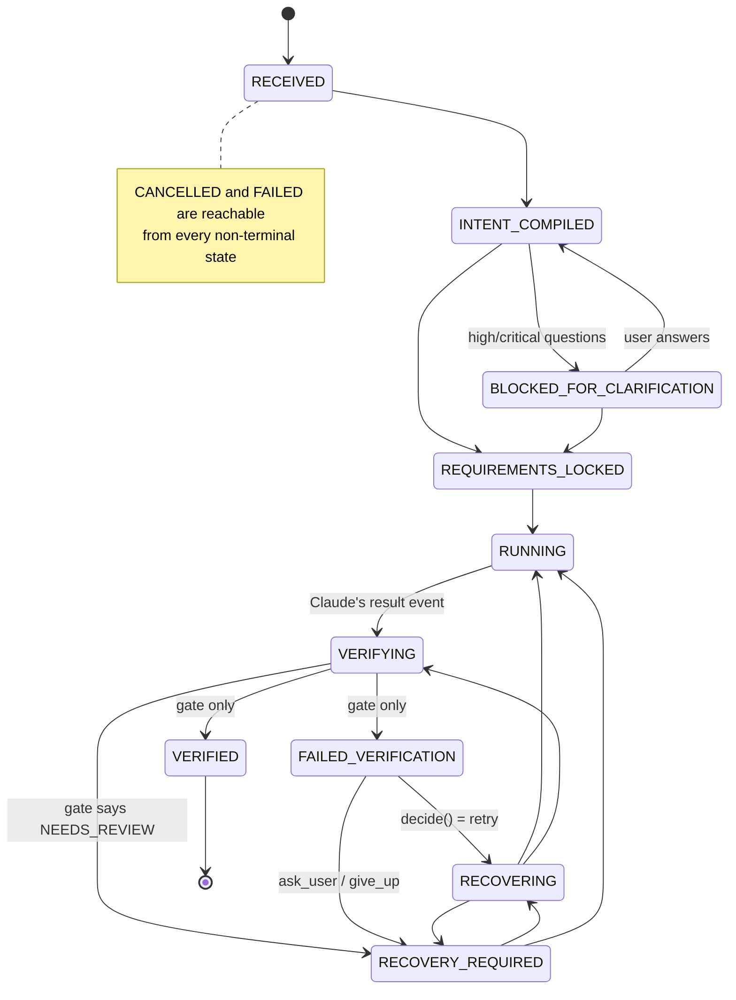
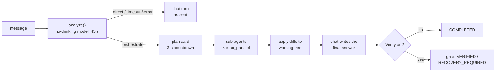

# Verified execution workbench

The workbench adds **Verified** and **Parallel** run modes to the `/chat` app,
plus multi-key provider pools, a credential vault, permission presets, and a
tamper-evident audit log. It ports the designs of the M0005 "AI Execution
Platform" project (`D:\My Projects\M0005(AI-Platform)\docs\`, architecture
docs 00-13 and `decisions/ARCHITECTURE_DECISIONS.md`) into idiomatic Python for
this repo. The porting plan and the API contract are in
[`docs/m0005-port/PLAN.md`](m0005-port/PLAN.md) and
[`docs/m0005-port/CONTRACTS.md`](m0005-port/CONTRACTS.md).

The core idea, from M0005's project charter: **a model response is not proof of
success.** Lock what the user asked for, route around rate limits, check the
result with real evidence, and recover only within fixed limits.

> **Unofficial project.** FCC is independent open-source work. It is not
> affiliated with, endorsed by, or supported by Anthropic. Claude and Claude
> Code are trademarks of Anthropic.

All paths below are relative to `src/free_claude_code/` unless they start with
`docs/`, `tests/`, or the repo root.

---

## 1. The four ideas and where they live

| M0005 idea | What it means | Implementation here |
|---|---|---|
| **Intent fidelity** (doc 03, ADR-004/009/021) | The request is the source of truth. The agent cannot silently redefine it. | `workbench/intent.py`: `compile_intent()` turns the prompt into an `IntentContract` (MUST / MUST_NOT / PRESERVE / SHOULD / OPTIONAL, scope, risk). `render_contract()` adds it to the prompt. Unclear requests block for clarification. |
| **Verified outcome** (doc 08, ADR-003) | Only real evidence can mark work done. | `workbench/verification/`: `detect_profile()`, `plan_checks()`, `run_gate()`, `compute_disposition()`. `workbench/tasks.py`: `TaskStore.record_evidence()` is the **only** path to `VERIFIED`. |
| **Key-pool resilience** (doc 05, ADR-019) | One rate-limited key must not stop the work. | `config/provider_keys.py` (parsing), `providers/key_pool.py` (`PooledProvider`, `EndpointPool`), `providers/endpoint_health.py` (circuit breaker), `providers/usage_records.py` (one row per attempt). |
| **Safe autonomy** (doc 09-10, ADR-008/014/018) | Autonomy grows only inside explicit limits. | `workbench/policy.py` (presets), `workbench/checkpoints.py` (snapshot and scoped revert), `workbench/recovery.py` (bounded retries), `core/vault.py` (encrypted secrets), `workbench/audit.py` (hash chain), `workbench/injection.py` (prompt-injection flags), per-chat budgets in `cli/managed/interactive.py`. |

### Wiring



- `runtime/bootstrap.py` opens one SQLite `Store` at `config_dir_path() / "fcc.db"`
  (normally `~/.fcc/fcc.db`) and one `EndpointPool(store)`.
- `runtime/application.py` builds `WorkbenchService(store, sessions=..., model_client_factory=self._model_client, usage_lookup=...)`
  and passes `launch_policy` to `InteractiveClaudeSessions` as its `policy_compiler`.
  Every chat event also goes to `WorkbenchService.observe()` (injection flags,
  usage, permission audit).
- Helper model calls (intent extraction, the planner, the optional judge) use
  `ProxyModelClient`, a non-streaming `POST /v1/messages` to the local proxy. They
  go through the same key pool as the chat and use the chat's model (or `MODEL`).
- `core/storage.py` `Store` is a thread-safe SQLite connection in WAL mode. Each
  feature registers its own tables with `store.migrate(feature, [sql...])`:
  `workbench_tasks`, `audit`, `endpoint_health`, `usage`, and the memory table.

---

## 2. Task lifecycle

Each Verified or Parallel run is one row in `workbench_tasks` (`TaskStore`,
`workbench/tasks.py`). `TRANSITIONS` rejects illegal moves. `VERIFIED` and
`FAILED_VERIFICATION` can be set only by `record_evidence()`. That function
also recomputes the disposition from the package's own checks and gap matrix
and refuses a package whose claim does not match.



Ultra runs that are not verified take a shorter path: `RECEIVED -> RUNNING ->
COMPLETED` when answered directly, and `... REQUIREMENTS_LOCKED -> RUNNING ->
COMPLETED` when orchestrated. `COMPLETED` means "done", never "verified".

Terminal states are `VERIFIED`, `COMPLETED`, `CANCELLED`, and `FAILED` (`tasks.TERMINAL`).
Every change is also stored as a `task.status` row in `workbench_events` and
published on the chat stream as `fcc_task`.

**Server restarts.** Runs and clarification waits live in the server process.
On startup `ApplicationRuntime.start()` calls `WorkbenchService.close_interrupted()`
(`TaskStore.close_interrupted()`): every task left in `RECEIVED`,
`INTENT_COMPILED`, `BLOCKED_FOR_CLARIFICATION`, `REQUIREMENTS_LOCKED`, `RUNNING`,
`VERIFYING`, or `RECOVERING` becomes `FAILED` with reason `server restarted`. A
task caught in `FAILED_VERIFICATION` keeps its evidence and becomes
`RECOVERY_REQUIRED`. Each one gets a `task.interrupted` audit record.

**Needs your attention.** `RECOVERY_REQUIRED` is not terminal. The UI labels it
"Needs your attention" and shows **Try again**, which calls
`POST /chat/api/tasks/{id}/resume`. `TaskCoordinator.run_resume()` gives the task
exactly one more attempt in the chat's live session (same folder required):
`RECOVERY_REQUIRED -> RECOVERING -> VERIFYING` re-runs the gate first (so a fix
you made by hand is picked up without prompting Claude); if that still fails it
sends one recovery prompt (`RUNNING`) and verifies again. The task ends
`VERIFIED` or back in `RECOVERY_REQUIRED`.

### Stream events

The coordinator publishes these synthetic events on the chat's SSE stream, so
they are also replayed to reconnecting windows. Shapes are in
[`CONTRACTS.md`](m0005-port/CONTRACTS.md).

| Event | Sent by | When |
|---|---|---|
| `fcc_task` | `TaskCoordinator._emit_status()` | Every lifecycle transition (`status`, optional `reason`) |
| `fcc_intent` | `_emit_intent()` | Contract compiled (`ready_to_lock` or `blocked_for_clarification` with `questions`) |
| `fcc_checkpoint` | `_checkpoint()` | Snapshot taken (`supported`, `head`) |
| `fcc_verification_started` | `_verify()` | Planned checks and level, before the gate runs |
| `fcc_verification_check` | `_verify()` | One per check, **after** the whole gate returns (see limitations) |
| `fcc_verification` | `_verify()` | Disposition plus the full evidence package |
| `fcc_recovery` | `run_verified()` / `run_parallel()` | Recovery decision (`retry`, `ask_user`, `give_up`) |
| `fcc_orchestration` | `run_parallel()` / `run_ultra()` | Each `Orchestrator.run()` event, unchanged, plus `ts` |
| `fcc_ultra` | `run_ultra()` | Lead-agent phase changes (see section 5b) |
| `fcc_budget` | `InteractiveClaudeSession._exceed_budget()` | A chat budget ran out and the turn was interrupted |
| `fcc_usage` | `WorkbenchService.observe()` | After each `result`: token, request, and failover totals for the Claude session |
| `fcc_injection` | `WorkbenchService.observe()` | A `tool_result` matched `injection.scan()` |

### Task routes

| Route | Purpose |
|---|---|
| `POST /chat/api/live/{live_id}/messages` `{"content", "mode", "strategy", "verify", "max_parallel"}` | `mode` is `normal`, `verified`, `parallel`, or `ultra`; `verify`/`max_parallel` (1-6) are Ultra only. Returns `{"ok": true, "task_id": ...}` |
| `POST /chat/api/tasks/{id}/clarify` `{"answers": "..."}` | Resume a task blocked for clarification |
| `GET /chat/api/tasks/{id}` | `{task, events[], evidence[]}` |
| `GET /chat/api/tasks/{id}/evidence?format=markdown\|json` | Latest evidence package |
| `POST /chat/api/tasks/{id}/revert` | Scoped revert to the checkpoint |
| `POST /chat/api/tasks/{id}/cancel` | Cancel a running or waiting task |
| `POST /chat/api/tasks/{id}/resume` `{"live_id": null}` | One more attempt for a `RECOVERY_REQUIRED` task (400 otherwise). Runs in `live_id`, or the task's own live chat |
| `GET /chat/api/project?cwd=...` | `{"git", "branch", "dirty"}`: the UI's Verified/Parallel preflight (400 for a missing folder) |
| `GET /chat/api/sessions/{session_id}/tasks` | All tasks of a Claude session, so reopened chats show their history |

All `/chat` routes keep the loopback and same-origin guards
(`require_loopback_admin`, `require_same_origin` in `api/chat_routes.py`).

---

## 3. A Verified run, step by step

`TaskCoordinator.run_verified()` in `workbench/coordinator.py`. The events
below are shortened and illustrative. Their field names match the code.

Prompt, sent with the run mode set to **Verified**:

> Add a `--verbose` flag to `cli.py`. Don't add new dependencies and keep the
> public API unchanged. Only modify `cli.py` and `tests/`.

**1. Task created.** `coordinator.start()` refuses the run if the session has
exited, is busy, or already has a task. Otherwise it creates the task and runs
it in the background.

```json
{"type":"fcc_task","task_id":"9f2c…","mode":"verified","status":"RECEIVED"}
```

**2. Intent compiled.** `compile_intent()` always runs `extract_deterministic()`
first. Clause splitting and regex rules find negations (`don't`, `never`,
`without`, `avoid`, `no …`), keep/leave phrases, `only modify …` scope, and
known operations (`git.push`, `git.commit`, `fs.remove`, `dependency.add`,
`db.migration`). If a model client is available, it can only **add** items.
Deterministic MUST / MUST_NOT / PRESERVE items are never removed. A model MUST
that overlaps a MUST_NOT keeps both and adds a warning. Bad model output falls
back to the deterministic contract (`degraded=True`).

Model-added MUST_NOT items never forbid what the user explicitly allowed. A
model item shaped like a scope restriction ("modify any file outside X and Y")
becomes `scope.allowed_paths` instead of a MUST_NOT. A model MUST_NOT or
`protected_paths` entry that names a path the user's own "only modify …" scope
allows is dropped with a warning. The same "outside/other than/except" reading
applies to the user's own "don't touch anything outside calc.py": the named
paths become allowed, not protected.

```json
{"type":"fcc_intent","task_id":"9f2c…","status":"ready_to_lock","questions":[],"warnings":[],
 "contract":{"goal":"Add a --verbose flag to cli.py",
   "must":["Add a --verbose flag to cli.py"],
   "must_not":["add new dependencies"],
   "preserve":["the public API"],
   "scope":{"allowed_paths":["cli.py","tests/**"],"protected_paths":[],"prohibited_ops":["dependency.add"]},
   "risk":"medium","verification_requirements":["unit_test","diff_scope","intent_conformance"]}}
```

Risk is `critical` if a destructive request is also unspecific (for example
"delete the old data"). It is `high` for destructive or sensitive words
(production, database, auth, payments, secrets), `low` for docs and UI
restyling, and `medium` otherwise. Vague pronoun plus vague outcome ("make it
better") raises a `high` question. Destructive plus unspecific raises a
`critical` question. Either one blocks:

```json
{"type":"fcc_task","status":"BLOCKED_FOR_CLARIFICATION","reason":"Which specific data/files does \"delete the old data\" refer to?"}
```

The UI shows a clarify box. `POST /chat/api/tasks/{id}/clarify` resolves the
waiting future. The prompt is recompiled with the answers appended and
`authorize_defaults=True`. If questions are still open after one answer, the
task proceeds and records them as a warning. It never asks twice.

**3. Requirements locked, checkpoint taken.** `create_checkpoint()` snapshots the
whole working tree, including untracked non-ignored files, through a temporary
index (`GIT_INDEX_FILE`). The commit is pinned at `refs/fcc/checkpoints/<id>`.
Your index, stash, and branches are not touched.

```json
{"type":"fcc_task","status":"REQUIREMENTS_LOCKED"}
{"type":"fcc_checkpoint","checkpoint_id":"4b1e…","supported":true,"head":"53f201b5…"}
{"type":"fcc_task","status":"RUNNING"}
```

**4. Claude runs.** The message sent to Claude Code is the prompt, then the
`<intent_contract>` block from `render_contract()`, then any matching verified
solution memory inside a `<verified_solution_memory>` block (section 9). Image
blocks attached to the message are sent first, as in a normal chat turn.
`_turn()` waits for the `result` event, up to `result_timeout_s` (1 hour).

Outside a git repository the run still goes ahead, but `fcc_intent.warnings`
carries `NOT_GIT_WARNING` ("not a git repository: changes can't be
checkpointed, reverted or scope-checked; result will be NEEDS_REVIEW at best"),
and the composer shows the same warning before you send in Verified mode.

**5. Verification.** `_verify()` detects the project profile, plans the checks,
and runs `run_gate()`:

```json
{"type":"fcc_task","status":"VERIFYING"}
{"type":"fcc_verification_started","attempt":1,"level":"standard","checks":[
  {"id":"unit_test","kind":"unit_test","command":["uv","run","pytest"],"required":true},
  {"id":"lint","kind":"lint","command":["uv","run","ruff","check","."],"required":false},
  {"id":"secret_scan","kind":"secret_scan","command":null,"required":true},
  {"id":"diff_scope","kind":"diff_scope","command":null,"required":true},
  {"id":"intent_conformance","kind":"intent_conformance","command":null,"required":true}]}
{"type":"fcc_verification_check","attempt":1,"check":{"id":"unit_test","kind":"unit_test","status":"failed","duration_ms":4210,"exit_code":1,"output_tail":"FAILED tests/test_cli.py::test_verbose - AssertionError…"}}
{"type":"fcc_verification","attempt":1,"disposition":"FAILED_VERIFICATION","evidence":{…}}
{"type":"fcc_task","status":"FAILED_VERIFICATION","reason":"required check 'unit_test' failed: …"}
```

- **Profile** (`verification/profile.py` `detect_profile()`): the first match
  of node, python, go, or rust wins. Commands come only from what the project
  declares, such as `package.json` scripts, a declared `pytest`, `ruff`, `ty`,
  or `mypy` (dependency or `[tool.x]` table), `go.mod`, or `Cargo.toml`.
  **Nothing is invented.** Python commands use `uv run` if `uv.lock` exists,
  `poetry run` for Poetry, and otherwise `.venv`'s python or `python -m`.
- **Level** (`plan_checks()`): contract risk maps to `low→minimal`,
  `medium→standard`, `high/critical→deep`. `CoordinatorOptions.level` can only
  raise it.

  | Level | Checks |
  |---|---|
  | minimal | typecheck, unit_test, secret_scan |
  | standard | + build, lint (advisory), diff_scope, intent_conformance |
  | deep | lint becomes required |

  Any MUST_NOT, PRESERVE, or scope item forces `diff_scope` and
  `intent_conformance` at every level.
- **Checks** (`verification/checks.py`): commands run with a timeout (600 s) and
  a tree kill. `secret_scan` looks only at added diff lines, redacts matches,
  and flags non-placeholder values in `.env*` files (templates such as
  `.env.example` are skipped). `diff_scope` fails on changes to protected paths
  or outside `allowed_paths`. `http_probe` is available but is not wired into
  chat runs.
- **Ignored tool state** (`workbench/ignore.py` `DEFAULT_DIFF_IGNORE`, shared
  with Parallel/Ultra scope checks and integration, see §5b): before any diff
  check, the gate drops files that hooks and runners write into every project
  during a run: `**/.claude-flow/**` (e.g. ruflo's `policy/state.json`),
  `**/.impeccable/**`, `**/.fcc-worktrees/**`, `**/.fcc-bench/**`, `**/__pycache__/**`,
  `**/.pytest_cache/**`, `**/.ruff_cache/**`. `.claude/**` is **not** ignored,
  because a task may legitimately edit Claude settings. Nothing is hidden
  silently: the evidence `warnings` list every ignored path. A project can add
  globs (matched against git-root-relative paths) in `<project>/.fcc/verify.json`:

  ```json
  {"ignore": ["build/**", "**/*.generated.ts"]}
  ```

  An unreadable or malformed file is reported as a warning and only the
  defaults apply.
- **Gap matrix** (`gap_matrix()`): one row per MUST (`M1…`), MUST_NOT (`N1…`),
  PRESERVE (`P1…`), and prohibited op (`X1…`). A MUST row is `covered` by a
  passing unit_test or http_probe, `failed` if one failed, and otherwise
  `missing`. A PRESERVE row is `covered` by passing tests and `failed` **only**
  when the preserved path itself changed; a failing test leaves it `missing`
  (the test failure is already reported and retried, it is not evidence that
  the preserved thing was touched). MUST_NOT and prohibited-op rows use diff
  heuristics (dependency manifests, migration/schema paths, auth paths, removed
  `def`/`class`/`export`, edits inside code fences, HEAD moved, deleted files,
  test paths). Only the forbidding part of a MUST_NOT names forbidden paths: in
  "modify any file outside calc.py and tests/test_calc.py" the listed paths are
  the allowed exception, so the row fails only for changes to *other* files.
  A row no heuristic can decide stays `missing`.
- **Disposition** (`compute_disposition()`):
  - `FAILED_VERIFICATION` if a required check failed or errored, or a row failed.
  - `NEEDS_REVIEW` if a required check was skipped or undecided, a row has no
    evidence, or **no project command or probe passed**.
  - `VERIFIED` otherwise.
- **Outcome judge** (optional, `CoordinatorOptions.use_judge`, off by default):
  a model grades each MUST from the evidence. It can fail a row or cover a
  `missing` one, but it can never turn a failure into a pass.

The `EvidencePackage` (`gate.py`) records the contract, checks (output capped at
8,000 characters), gap matrix, failures, base/checkpoint/head commits, the
snapshot tree, the diff's SHA-256 and stat, changed files, and timestamps.
`render_markdown()` produces the export.

**6. Recovery** (next section). With `action=retry`, the coordinator moves
`FAILED_VERIFICATION → RECOVERING → RUNNING` and sends
`build_recovery_prompt()`: the failing checks with their parsed failures and
output tail, the unmet requirements, the locked constraints quoted exactly, the
scope, and "do not claim success yourself". Then the gate runs again.

```json
{"type":"fcc_recovery","attempt":1,"action":"retry","strategy":"targeted_fix","reason":"test: unit_test_failed"}
{"type":"fcc_task","status":"RECOVERING"} {"type":"fcc_task","status":"RUNNING","reason":"targeted_fix"}
…
{"type":"fcc_verification","attempt":2,"disposition":"VERIFIED","evidence":{…}}
{"type":"fcc_task","status":"VERIFIED"}
```

Every gate result is also written to the audit log as
`verification.completed`. A `VERIFIED` result with changed files is saved as a
promoted solution-memory entry.

---

## 4. Recovery ladder

`workbench/recovery.py` `decide(evidence, history)`:

| Rule | Value |
|---|---|
| Max attempts for one failure fingerprint | `MAX_PER_FINGERPRINT = 3` |
| Max recovery attempts in total | `MAX_TOTAL = 8` |
| Categories that go straight to `ask_user` | `security`, `scope`, `intent` (`ASK_USER_CATEGORIES`) |
| `NEEDS_REVIEW` package | `ask_user` |

Failures come from `verification/failures.py`. Parsers cover pytest, ruff,
mypy, ty/rustc-style, tsc, jest/vitest, go test, and cargo, with a generic
fallback. A **fingerprint** hashes check id, code, path, line, and message
after stripping temp dirs, UUIDs, hex ids, and durations, so the same failure
matches across runs. `categorize()` also finds environment, provider
(rate-limit), database, timeout, and runtime errors from text.

The primary failure is the first `security`/`scope`/`intent` failure that is not
a knock-on effect of a failed check (`_derived`), or else the first failure.
Each category walks its own ladder, so a repeated fingerprint always gets a
**different** strategy:

| Category | 1st | 2nd | 3rd |
|---|---|---|---|
| environment | inspect_environment | remediate_dependency | ask_user |
| build | targeted_fix | inspect_environment | alternative_approach |
| type | targeted_fix | alternative_approach | ask_user |
| runtime, logic, test | targeted_fix | reproduce_and_isolate | alternative_approach |
| API | targeted_fix | inspect_environment | ask_user |
| database | inspect_environment | targeted_fix | ask_user |
| UI, performance | targeted_fix | alternative_approach | ask_user |
| provider | bounded_retry | bounded_retry | ask_user |
| tool | bounded_retry | alternative_approach | ask_user |

`ask_user` and `give_up` end the run in `RECOVERY_REQUIRED`. The evidence and
the reason stay in the Verification panel. Parallel runs do not retry
automatically: a failed gate always reports `ask_user`.

---

## 5. Parallel mode

`TaskCoordinator.run_parallel()` plus `workbench/orchestration/`.

> **Approvals from steps.** When a node session needs a tool approval, it appears in the chat as
> `fcc_node_permission` (rendered "Step &lt;node&gt; wants to run &lt;tool&gt;"), and the task-graph node shows
> "Waiting for approval". Answering posts to the node's own `live_id`. Unanswered prompts fail the node
> after `CoordinatorOptions.node_permission_timeout_s` (default: the node wall-time budget, 900 s) with
> "timed out waiting for approval of &lt;tool&gt;".

1. **Intent and checkpoint**, the same as in Verified mode.
2. **Plan** (`planner.plan()`): one model call returns a JSON DAG of at most
   `MAX_NODES = 6` nodes. Each node has `id`, `objective`, `role`, `depends_on`,
   `write_scope` (repo-relative globs, `[]` means read-only), and
   `acceptance_criteria`. Any call, parse, or validation failure falls back to
   `fallback_plan()`: one `implementation` node with `write_scope=["**"]`.
   Absolute paths and `..` in write scopes are rejected.
3. **Preconditions** (`worktrees.require_clean_repo()`, `current_branch()`):
   the folder must be a git repo with at least one commit, a clean tree
   (untracked files count as dirty), and a checked-out branch (not a detached
   HEAD). Otherwise the run emits `orchestration_failed` and the task ends
   `FAILED`. The UI checks the same thing with `GET /chat/api/project` and
   disables send in Parallel mode, with the reason, when the folder is not a
   git repo or the tree is dirty.
   **Protected base branch**: if the checked-out branch is `main`, `master`, or
   `release/*` (`policy.is_protected_branch()`), the orchestrator first creates
   and checks out a working branch `fcc/<task_id>` from it, so a protected
   branch is never committed to. If nothing gets merged (all nodes failed, or
   the run is cancelled) it switches back and deletes that branch.
4. **Run nodes** (`runner.Orchestrator`): at most `PARALLELISM[strategy]` nodes
   run at once (`economy` 1, `balanced` 3, `fastest` 6). A mutating node gets its
   own worktree under `.fcc-worktrees/<task>/<node>` on branch
   `fcc/<task>/<node>`, created from the base commit with its completed
   dependencies merged in. It also takes a **write-scope lease**
   (`leases.LeaseManager`), so nodes with overlapping scopes run one after
   another. Read-only nodes run in the main repo in `plan` mode. Each node is a
   fresh headless `InteractiveClaudeSession` whose prompt has the objective, the
   contract quoted exactly, the write scope, dependency summaries, and "do not
   commit, push, or switch branches", plus the message's image blocks. Node
   sessions get the chat's **policy preset** (its rules, and its mode when that
   is stricter than `acceptEdits`/`plan`), a **turn budget**
   (`CoordinatorOptions.node_max_turns`, default 30, lowered to the chat's
   `max_turns`; enforced with `--max-turns` and the chat turn budget), and
   matching verified solution memory as `--append-system-prompt`. Nodes time out
   after 900 s. When a node fails, its dependents become `blocked`.
5. **Scope enforcement and integration** (`integration.py`):
   `enforce_scope()` reverts files a node changed outside its write scope, on
   the node's own branch, and reports them. `integrate()` merges completed
   branches `--no-ff` into the checked-out branch (the working branch for a
   protected base) in dependency order.
   A conflict aborts that merge and is reported. Merged worktrees are removed.
   Failed ones are kept for debugging (`kept_worktrees`).
6. **Gate** on the integrated result, the same as in Verified mode, but with no
   automated recovery.

Example `fcc_orchestration` payloads (the `event` field):

```json
{"type":"orchestration_started","base_commit":"53f2…","base_branch":"main","working_branch":"fcc/9f2c…","graph":{"nodes":[…]}}
{"type":"node_started","node_id":"api","role":"implementation","branch":"fcc/9f2c…/api","permission_mode":"acceptEdits","live_id":"…"}
{"type":"node_progress","node_id":"api","tools":["Edit"]}
{"type":"node_completed","node_id":"api","summary":"…","turns":7,"reverted_out_of_scope":[]}
{"type":"integration_completed","status":"ready_for_verification","merged":["api","ui"],"conflicts":{},"final_diff_stat":"…"}
{"type":"orchestration_completed","status":"ready_for_verification","kept_worktrees":[],"working_branch":"fcc/9f2c…"}
```

The UI draws the graph as cards with a status for each node (`graphNode()`,
`graphCard()` in `chat.js`).

---

## 5b. Ultra mode (the default)

`TaskCoordinator.run_ultra()`, `planner.analyze()`, `workbench/ultra.py`. Ultra is the
chat's default run mode: a **lead agent** decides per message whether to answer
directly or to split the work across **parallel sub-agents**, like Claude Code's
lead agent dispatching subagents. It works in any folder: git or not, clean or dirty.



1. **Analysis** (`planner.analyze()`): one call through the proxy
   (`analysis_client_factory`, `ApplicationRuntime._analysis_client()`) to
   `ULTRA_ANALYSIS_MODEL` (Admin UI: Model Routing → Ultra Analysis Model), or
   `MODEL` when unset, always as its **no-thinking** gateway id
   (`claude-3-freecc-no-thinking/<provider>/<model>`, which the router sends with
   reasoning `OFF`) and `max_tokens = ANALYSIS_MAX_TOKENS` (1500). The compact
   `ANALYZE_PROMPT` (~500 input tokens) asks for 1-3 sentence briefs, so a plan is
   ~600 output tokens. Bounded by `CoordinatorOptions.ultra_analysis_timeout_s`
   (45 s). Measured on NIM `nemotron-3-ultra-550b-a55b`: routing-only replies
   1-4 s, 3-4 node plans 7-15 s (with reasoning on: 2 s / 9-20 s, and some
   plans past 45 s). The reply is `{"route": "direct"|"orchestrate", "reason", "nodes"}`;
   nodes are the Parallel-mode node schema plus **`instructions`** (the lead
   agent's brief: what to do, files, constraints). No model, a timeout, an error, an unusable reply, or a plan
   that validates to a single node all route to **direct** (`degraded` tells
   which). Recorded as the `ultra.analysis` task event (`route`, `reason`,
   `degraded`, `analysis_ms`, `nodes`).
2. **Direct fast path**: the message goes to the chat session unchanged
   (`RECEIVED -> RUNNING -> COMPLETED`). With **Verify the result** on it runs
   as a Verified task instead (`run_verified()`).
3. **Plan**: a deterministic intent contract (no second model call) is locked
   and quoted to every sub-agent, a checkpoint is taken, and `fcc_ultra`
   `planned` carries the plan. After `ultra_dispatch_delay_s` (3 s; the UI shows a
   countdown with **Stop**) the run dispatches. No confirmation is needed.
4. **Sub-agents** (`Orchestrator`, up to `max_parallel`, default
   `ultra_max_parallel = 4`, 1-6 from the chat's session settings).
   **Memory-aware**: before dispatch `resources.memory_parallel_cap()` lowers it
   so every Claude Code process (~400 MB each) fits in available physical memory
   while keeping 1.5 GB free (`GlobalMemoryStatusEx` on Windows,
   `/proc/meminfo` `MemAvailable` or `os.sysconf` on POSIX; never below 1, and
   unchanged when memory cannot be read). `planned` carries `effective_parallel`
   and `parallel_limited_by: "memory"` (else `null`); the card shows "running N
   at a time (low memory)". Parallel mode applies the same cap to its strategy.
   **Crash retry**: a node whose Claude Code process exits without a `result`
   (a crash such as exit `0xC0000409`, any non-zero exit, or the stream ending)
   is retried **once** in a fresh session. First its git worktree is reset to
   the node's start commit (`reset --hard` + `clean -fd`); in place (no git)
   nothing can be restored, so the files the crashed attempt changed are listed
   in `node_retry.partial_files` and stay for the retry to finish or overwrite.
   User cancel, the wall-time budget, the turn budget (an error `result`), a
   permission timeout, and an error result are never retried. The retry shares
   the node's 900 s wall-time budget. Each prompt
   has the objective, "Instructions from the lead agent", the contract, the write
   scope, and the summaries of its dependencies. Workspaces:
   - **git (dirty or clean)**, `workspace="snapshot"`: worktrees start from the
     checkpoint snapshot commit (tracked edits, staged edits and untracked files
     included), not HEAD. Out-of-scope edits are reverted on the node's branch.
     `integration.apply_to_worktree()` then applies each node's diff
     (`start_commit..branch`) to the working tree in dependency order, file by
     file: an untouched file takes the node's version, a file you also changed is
     3-way merged (`git merge-file`), and a conflict (or a diverged
     binary/deleted file) is left alone and reported; the node's worktree is
     kept for manual review. HEAD, the branch and the index are never touched and
     nothing is committed.
   - **no git**, `workspace="in_place"`: nodes run in the folder itself.
     Write-scope leases keep concurrent writers disjoint (overlapping scopes
     serialize); read-only nodes run in `plan` mode. A before/after scan
     (`scan_tree()`, mtime + size, skipping `.git`, `node_modules`, caches)
     attributes changes: files outside the scopes of every node that ran at the
     same time are reported as `out_of_scope` (not reverted: there is nothing to
     restore from).
   - **Tool state** (both workspaces, and Parallel mode): paths matching the
     verification gate's ignore rules (`workbench/ignore.py`:
     `DEFAULT_DIFF_IGNORE` + the project's `.fcc/verify.json`, see §3) are never
     committed on a node branch (`commit_all(..., ignore)`), so they are never
     reverted, applied, merged or reported as out-of-scope. They are listed once
     in `orchestration_completed.ignored_files` and in the report as "Ignored
     tool-state files".
5. **Synthesis**: the chat session receives `synthesis_prompt()`: an
   `<fcc_ultra_report task_id=...>` block with the original request in
   `<user_request>`, one section per sub-task (status, files changed, reverted /
   out-of-scope files, error, report) and the integration result, then the
   instruction to write the final answer. The chat UI renders that prompt as a
   collapsed "Sub-agent reports" chip, not as a user message.
6. **Finish**: `COMPLETED` (done, no verification claim), or with Verify on the
   normal gate on the integrated result (`VERIFIED` or `RECOVERY_REQUIRED`).
   Revert uses the checkpoint as usual (git only).

`fcc_ultra` phases: `analyzing` (`request`) → `direct` (`route`, `reason`,
`degraded`, `analysis_ms`) or `planned` (`plan`, `max_parallel`,
`effective_parallel`, `parallel_limited_by`, `workspace`, `dispatch_in_s`) → `dispatching` → `integrating` → `summarizing` → `verifying`
→ `done` (`status`, `elapsed_ms`) / `failed` (`error`) / `cancelled`. Every
`fcc_ultra` and Ultra `fcc_orchestration` event carries `ts` (epoch seconds) so
replays show true elapsed times. `node_progress` adds `activity`
(`"Write src/x.py"`, `"Bash pytest -q"`); `node_started` adds `attempt`
(1, or 2 after a crash); `node_retry` (`node_id`, `attempt`, `error`,
`reset`: `worktree`|`none`, `partial_files`) precedes a retried node's second
`node_started`; `node_completed` adds `changed_files`, `out_of_scope`,
`elapsed_s`; `orchestration_completed` adds `ignored_files`.

**UI** (`renderUltraCard()`, `ultraLane()` in `chat.js`): the request shows at
once; the card has the main agent's steps (Analyze → Plan → Dispatch →
Integrate → Summarize), the countdown, and one lane per sub-agent with its
expandable instructions, live tool activity, status, elapsed time, changed files
and summary. Node approvals work as in Parallel mode. **Stop** (on the card, or
the composer's stop button) cancels the task: the countdown, every sub-agent,
or the synthesis turn.

---

## 6. Checkpoints and revert

`workbench/checkpoints.py`:

- `create_checkpoint(cwd)` returns an **unsupported** checkpoint
  (`commit=None`) outside git. The UI then disables **Revert**.
- `diff_since(cp)` snapshots the current tree the same way and diffs the two
  trees with `--no-renames`.
- `revert_task(cp, files=None)` restores only files that changed since the
  checkpoint, back to their checkpoint content. Files the task created are
  deleted, and only when they resolve inside the repo root. Files that did not
  change are ignored, so unrelated user work is kept.
- `drop_checkpoint(cp)` removes the pinning ref.

`TaskCoordinator.revert()` refuses a running task ("Cancel the running task
before reverting it.") and writes a `task.revert` audit record. In the UI:
**Revert task changes** in the Verification panel, after a confirm dialog.

For a Parallel run that integrated on its own working branch (protected base),
revert first runs `worktrees.reset_working_branch()`: with that branch checked
out it does `git reset --keep <base commit>`, which removes the integration merge
commits (they stay reachable in the reflog) and refuses to overwrite uncommitted
edits to the same files. Then the checkpoint revert restores anything changed
after that. The branch itself is kept; delete it when you no longer need it. For
a Parallel run on an unprotected branch, revert restores the files only: the
merge commits stay on your branch.

---

## 7. Permission presets

`workbench/policy.py` compiles a preset into Claude Code `--settings` JSON
(`permissions.allow/ask/deny/defaultMode`). `launch_policy(preset, cwd)` in
`workbench/service.py` adds the current git branch and the project's
`.fcc/policy.json` rules. A chat started with `policy_preset` passes
`--settings <json>` and runs in the preset's permission mode, unless
`permission_mode` asks for a **stricter** one (`effective_permission_mode()` in
`core/claude_permission_modes.py`). Strictness, least to most:
`bypassPermissions < auto < acceptEdits < default < dontAsk < plan`, so `plan`
is always allowed. A looser request is ignored, and a later
`set_permission_mode` to a looser mode is refused ("… allows 'acceptEdits' or a
stricter mode"). The `/chat` UI sends `permission_mode: null` while a preset is
selected and shows the mode from the session snapshot (`dontAsk` is shown as
"Don't ask (read-only)"); modes looser than the preset are disabled in the mode
menu and skipped by Shift+Tab. Claude Code evaluates deny, then ask, then allow, and
merges lists across settings scopes, so these ask/deny rules win over allow
rules from your own settings.

### Built-in rules (every preset)

| Decision | Rule | Why |
|---|---|---|
| ask | `Read(//**/.env*)`, `Read(//**/*.pem)`, `Read(//**/*.key)`, `Read(//**/id_rsa*)`, `Read(//**/id_ed25519*)` | Reading a likely secret file needs approval |
| deny | `Edit(//**/.git/**)` | Never write inside `.git`; use git |
| ask | `Bash(<cmd> *)` and `PowerShell(<cmd> *)` for each of `rm rmdir rd del erase format diskpart shutdown reg takeown icacls chown chmod mkfs dd Remove-Item Format-Volume Clear-Disk Stop-Computer Restart-Computer` | Destructive command |
| ask | `Bash(git push *)`, `PowerShell(git push *)` | `git push` needs approval |
| deny | `git push *--force*`, `git push -f *`, `git push * -f`, `git push * -f *`, `git push * +*` (both shells) | Force push is never allowed |
| ask | `git commit/merge/revert/rebase *` (both shells) | Only when the branch at session start is `main`, `master`, or `release/*` |

### Presets

| Preset | Permission mode | Adds |
|---|---|---|
| `restricted` | `dontAsk` (anything that would prompt is refused) | allow `Read`, `Grep`, `Glob`, `Bash(git status/diff/log/show *)`; deny `Edit`, `Write`, `NotebookEdit`; deny `git commit/reset/checkout`, `mv`, `cp`, `mkdir`, `touch`, `npm install`, `pip install`, `uv add`; deny every destructive command; deny network commands (`curl wget Invoke-WebRequest Invoke-RestMethod ssh scp`); sets `disableBypassPermissionsMode: "disable"` |
| `workspace` | `acceptEdits` | allow `Edit(./**)`; ask for network commands |
| `privileged` | `bypassPermissions` | nothing extra. The built-in ask/deny rules still prompt or block. |
| none (UI "No FCC policy") | whatever you chose | no `--settings`: Claude Code's own settings apply |

**Project rules**: `<project>/.fcc/policy.json` may contain `{"ask": [...], "deny": [...]}`.
An `allow` key, unknown keys, and malformed rules are rejected (`PolicyError`),
so a repository can only tighten the policy. `validate_rule()` checks rule
syntax: known tools, POSIX paths written `//c/...` for absolute paths,
`domain:` for WebFetch, and `:*` only at the end of a pattern.

See the current rules with `GET /chat/api/policy/presets` (or
`/admin/api/policy/presets`, or the Admin **Policy** view). Each preset lists
its mode and its rules as `DECISION rule - reason`.

---

## 8. Budgets

`POST /chat/api/live` accepts
`"budget": {"max_turns": 40, "max_minutes": 30, "max_output_tokens": 200000}`.
Any field may be `null`; `max_minutes` may be fractional (the UI accepts steps
of 0.5). The budget is enforced by `InteractiveClaudeSession`
(`_check_budget()`, `_time_budget_spent()`):

- **turns**: assistant messages across the chat, counting the running turn.
- **output tokens**: from each assistant message's `usage`, then the `result`.
- **time**: busy wall time only (a timer runs while a turn is in progress).

When a limit is passed, the session publishes `fcc_budget` and interrupts the
running turn. After that it refuses new messages ("This chat's … budget is used
up; start a new chat to continue."). The snapshot's `usage` shows
`{input_tokens, output_tokens, turns, elapsed_s}`.

---

## 9. Verified solution memory

`workbench/memory.py` `SolutionMemory` (M0005 ADR-008). After a `VERIFIED` run
with changed files, the coordinator stores the goal and Claude's summary (or
the diff stat), with SHA-256 hashes of the changed files. It then promotes the
entry at once with `promote(task_id, verified=True)`. Only `promoted` entries
are searchable. Before each run, `mark_stale(cwd)` marks any entry whose source
files changed as `stale`. `search()` ranks the rest by term overlap. Entries
whose text looks like an `nvapi-…`, `sk-…`, AWS key, or private key are
refused. Memory is keyed by the chat folder.

Where matches go depends on whether a Claude process is started for the task:

- **Parallel**: node sessions are new processes, so the block is passed as
  `--append-system-prompt` (`OrchestratorOptions.extra_system_prompt`).
- **Verified**: the chat's process is already running and memory is chosen per
  task, so the system prompt cannot change. The block is appended to the task
  message, wrapped in `<verified_solution_memory>…</verified_solution_memory>`
  and stating "Use them only where they fit; the current request always wins".

---

## 10. Credential vault

`core/vault.py` (ADR-014). The file is `vault.bin` in the FCC config
directory: `b"FCCV1"` magic, a 12-byte nonce, then AES-256-GCM over
`{"version":1,"secrets":{name:value}}`. Secret names are encrypted too. The
256-bit master key is protected by:

- **Windows**: DPAPI (CurrentUser), stored as `vault.key` next to the vault.
- **macOS**: a login Keychain item (`security -i`, key sent on stdin).
- **Linux**: Secret Service via `secret-tool` (key sent on stdin).

There is **no plaintext fallback**. Without a backend, every operation raises
`VaultUnavailable`. Writes are atomic and use an interprocess file lock.

### `fcc-secret`

```powershell
fcc-secret set nvidia            # hidden prompt; or pipe:  "nvapi-..." | fcc-secret set nvidia
fcc-secret list                  # names only
fcc-secret delete nvidia
fcc-secret migrate               # move plaintext *_API_KEY(S) from ~/.fcc/.env into the vault
```

`fcc-secret set NAME VALUE` is refused on purpose, because a value on the
command line leaks into shell history and process lists. Names must match
`[A-Za-z0-9_.-]{1,128}`.

### `vault:<name>` references

In `~/.fcc/.env`:

```dotenv
NVIDIA_NIM_API_KEY=vault:nvidia
NVIDIA_NIM_API_KEYS=vault:nim-pool      # a whole "label=key,..." list can live in one secret
```

`config/loader.py` `resolve_vault_refs()` replaces `vault:` values when
settings load. A missing secret or an unavailable vault gives a clear error
that names the setting, never the value. The Admin config view shows the
reference (`vault:nvidia`), not the resolved value (`config/admin/values.py`).

`migrate` (CLI, or **Admin → Secrets → Move keys**) matches
`^[A-Z0-9_]+_API_KEYS?$`. It writes a timestamped backup
`.env.bak-YYYYMMDD-HHMMSS` first (`chmod 600` on POSIX), stores every value, and
only then rewrites the `.env` with `vault:<KEY>` references. **The backup
still holds the plaintext keys.** Delete it once FCC starts correctly.

Admin API: `GET/PUT/DELETE /admin/api/secrets[/{name}]`, `POST /admin/api/secrets/migrate`.
They return names only and write `secret.set`, `secret.delete`, and
`secret.migrate` audit records. New values are registered with
`register_secret_value()`, so logs redact them.

---

## 11. Multi-key pools and endpoint health

### Configuration

Every key-based provider has a plural companion setting, `<KEY_ENV>S`
(`ProviderDescriptor.credential_pool_env`):

```dotenv
NVIDIA_NIM_API_KEYS="work=nvapi-aaa,personal=nvapi-bbb"
# or a plain list; labels become key1..N
OPENROUTER_API_KEYS="sk-or-1,sk-or-2"
```

`config/provider_keys.py` `parse_provider_keys()` splits on commas or
newlines. Labels match `[A-Za-z0-9_.-]{1,40}`, duplicate keys keep their first
entry, and duplicate labels get a `-N` suffix. The single `<KEY_ENV>` still
works. If it holds a key that is not already in the list, it joins the pool as
`primary`. Keys never appear in `repr`. Only labels and a 12-character SHA-256
**fingerprint** leave the module. A replaced key under the same label gets a
fresh health record.

`providers/runtime/factory.py` wraps any key-based provider in a
`PooledProvider` (one inner client per key) when the runtime has an
`EndpointPool`. With several keys, each inner client makes one attempt and the
pool owns retries. With one key, the pool only gates on health and the inner
client keeps its normal retries.

### Health and circuit rules

`providers/endpoint_health.py` (ADR-019), defaults in `HealthPolicy`:

| Signal (from `key_pool.health_signal()`) | Effect |
|---|---|
| rate limited (429) | `DEGRADED`, cooldown = `Retry-After`, else 20 s. **Never opens the circuit.** |
| quota exhausted (429 with quota/credits/billing text, or 402) | `DEGRADED`, cooldown 1 h |
| transient (overloaded, timeout, unavailable, retryable upstream) | consecutive-failure count. 3 in a row → `OPEN` for 30 s → `HALF_OPEN`, which admits exactly one probe. Success → `HEALTHY`. A failed probe → `OPEN` again. |
| auth failed (401/403) | `OPEN` **until manual reset** |
| no impact (bad request, context length, …) | ignored |

Health is saved to the `endpoint_health` table on every change and survives
restarts. Reset a key with `POST /admin/api/endpoints/{provider}/{label}/reset`
or the Admin **Endpoints** view.

### Selection and failover

`PooledProvider._ranked()` orders keys by circuit (`HEALTHY` < `DEGRADED` <
`HALF_OPEN` < `OPEN`), then consecutive failures, then in-flight requests, then
least recently selected, then configured order. `_stream()`:

- At most `DEFAULT_MAX_ATTEMPTS = 4` attempts (1 if the pool has one key).
  Untried keys come first.
- Failover happens **only before the first streamed chunk**. After output has
  started, the failure is raised to the client. No-impact failures are never
  retried.
- **Stalled streams** (`providers/http.py` `open_guarded_stream`, ADR-019):
  every OpenAI-chat request (NVIDIA NIM included) must deliver its first
  stream chunk within `HTTP_FIRST_BYTE_TIMEOUT` (default 120 s; NIM reasoning
  models are slow to their first token), then each next chunk within
  `HTTP_STREAM_IDLE_TIMEOUT` (default 90 s). These count parsed chunks, so SSE
  keep-alive comments that defeat the socket-level `HTTP_READ_TIMEOUT` cannot
  hold a request open. A stall fails as the retryable `timeout` kind: it marks
  the key transient-unhealthy, fails over to the next key (before the first
  chunk), and then reaches `MODEL_FALLBACKS`.
- If every key is cooling down or busy, the pool waits for the earliest one up
  to `DEFAULT_MAX_WAIT_S = 60` s, then raises a 429 with a retry-after. If every
  key needs a manual reset, it raises a 401 that names the reset route. The
  final failure then reaches the normal `MODEL_FALLBACKS` handling.

`GET /chat/api/endpoints/summary` feeds the chat's **endpoint health chip**
(`loadHealth()` in `chat.js`, polled every 20 s). It shows healthy/total keys
for each provider, and clicking it opens Admin.

---

## 12. Usage dashboard

`providers/usage_records.py` `UsageRecorder` writes one row per provider
**attempt**: provider, key **label** (never the key), model, request id, Claude
session id, input and output tokens (read from the SSE `usage` fields), latency,
outcome (`ok`, `rate_limited`, `quota_exhausted`, `auth_failed`, `failed`,
`rejected`, `cancelled`), failure kind, attempt number, and `failover_from`.

The Claude session id comes from the `X-Claude-Code-Session-Id` header that
Claude Code sends on every request. `api/request_ids.py` binds it with
`core/request_context.py` `bind_claude_session_id()` (an FCC-owned
`ContextVar`) for the whole request, and the key pool reads
`current_claude_session_id()` when it writes the row.

`GET /admin/api/usage?minutes=60` returns:

- `endpoints`: for each provider and key, requests, ok, errors, rate limits,
  latency p50/p95 (successful attempts only), and tokens.
- `sessions`: for each Claude session, attempts, ok, failovers, and tokens.
- `recent`: the last 50 rows.

The Admin **Usage** view shows these for 15 minutes, 1 hour, 24 hours, or 7 days.
In chat, `fcc_usage` shows the current session's totals after each turn.

---

## 13. Audit log

`workbench/audit.py` `AuditLog`, stored in the `audit_log` table.

- Each row has `hash = sha256(canonical JSON of the row without hash)`, and the
  row includes `prev_hash`. The first row chains to 64 zeros.
- SQLite triggers reject `UPDATE` and `DELETE`.
- `verify()` re-hashes the whole chain and returns `(ok, first_bad_id)`. That
  catches edits made by dropping the triggers or editing the file directly, and
  also gaps in ids.
- Payloads have credential-named keys removed (`sanitize_trace_value`) and
  credential-shaped strings scrubbed (`redact_sensitive_error_text`).

Recorded actions: `permission.decision` (every answered permission card),
`verification.completed`, `task.revert`, `secret.set`, `secret.delete`,
`secret.migrate`, and `config.apply` (field names only).

`GET /admin/api/audit?limit=&action=&actor=` returns `{verified, first_bad_id, records}`.
The Admin **Audit** view shows a status pill: "Chain verified" or "Tampered at id N".

---

## 14. Prompt-injection flags

`workbench/injection.py` `scan()` checks every `tool_result` in the chat for
instruction overrides ("ignore previous instructions"), role impersonation
(`system:`, `<system>`, "you are now"), requests to exfiltrate secrets,
requests to run tools, and hidden text (zero-width or bidi characters, HTML
comments, `display:none`). A match publishes `fcc_injection`, and the tool card
gets an **Injection?** badge (`markInjection()`). Nothing is blocked. This is
a warning for the person reading. `wrap_untrusted()` exists for delimiting
external content but is not yet used by the chat flow.

---

## 15. Benchmarks

> **TODO**: `fcc-bench` is not in `pyproject.toml` `[project.scripts]` yet. The
> suite is being built separately (PLAN.md phase E).

Planned shape, from PLAN.md and M0005 doc 13: seeded scenario repositories
(for example a failing test to fix, or a change with a MUST_NOT to respect),
each run through a Verified task with a pinned profile
(`CoordinatorOptions.profile` exists for this). The suite measures
**time-to-verified-outcome** and counts a **false completion** (the agent says
it is done but the gate does not return VERIFIED, or the evidence is wrong) as
a hard failure. Update this section with the real command and flags when the
script lands.

---

## 16. Security notes and known limitations

Read these before relying on the workbench.

**Intent**
- The deterministic extractor uses **English-only** regex heuristics. Other
  languages, or unusual phrasing, produce weaker contracts (often a single MUST
  and no MUST_NOT). A model extractor can add items, but it runs on the same
  (possibly free and weak) model.
- Clarification is asked once. Questions still open after that are recorded as
  warnings and the run continues.

**Verification**
- A MUST row counts as `covered` when **any** unit test passes. The gate does
  not know which test proves which requirement. The optional judge is off by
  default.
- MUST_NOT and prohibited-op checks are **coarse diff heuristics** (path names,
  removed `def`/`class` lines, dependency manifest edits). Anything they cannot
  decide becomes `NEEDS_REVIEW`. `git push` cannot be observed at all.
- Verified mode needs git to reach `VERIFIED`. Without a checkpoint,
  `secret_scan` is skipped, and it is a required check, so the result is always
  `NEEDS_REVIEW`. The run is allowed, with a warning in `fcc_intent.warnings`
  and in the composer. A project with no declared test, build, or typecheck command
  also stops at `NEEDS_REVIEW` ("nothing executable proves the change").
- One ecosystem per folder (the first of node, python, go, rust wins).
  Polyglot repos are only partly checked.
- Verification runs the **project's own commands** (tests and scripts) on your
  machine with no sandbox. Only verify repositories you trust.
- `fcc_verification_check` events arrive after the whole gate finishes, not
  live.

**Recovery and lifecycle**
- `RECOVERY_REQUIRED` is resumed only when you click **Try again**, one attempt
  per click. Resume needs a live chat in the task's folder.
- Task runs and clarification waits live in memory. A server restart fails
  every task that was mid-run (reason `server restarted`); the work is not
  continued.
- Intent compilation, the planner, and memory search see only the text of a
  message. Images reach Claude (and every parallel node) but cannot add contract
  items.

**Checkpoints**
- Revert restores **every file changed since the checkpoint**, including edits
  you made yourself in the same files while the task ran.
- The snapshot hashes every non-ignored file. This is slow for repos with large
  build outputs that are not ignored.

**Parallel**
- On an unprotected branch, integration merges straight into your checked-out
  branch with `--no-ff` merge commits, and revert restores files only (the
  commits stay). Protected branches (`main`, `master`, `release/*`) get a
  `fcc/<task_id>` working branch instead; revert resets it. Other branch
  names you consider protected are not detected.
- Node sessions get the chat's policy preset and a turn budget, but not its
  time or token budget; the 900 s node timeout is the time limit. Headless
  nodes cannot answer permission prompts: a command that asks waits until the
  node times out (use a preset whose mode never asks for such commands).
- Write-scope leases are held in memory by one server process.

**Ultra**
- The analysis model gets only the message text and a 1500-token output cap; a
  very large plan (6 nodes with long briefs) can be cut off, which degrades to a
  direct run. Latency still depends on the provider: NIM calls vary from 7 s to
  over 45 s for the same plan request, and a timeout also runs directly.
- The memory cap is sampled once, when the plan is made; memory freed or used
  later in the run does not change it. The ~400 MB per agent is an estimate.
- A crashed node is retried once in a fresh session without the crashed
  session's context. In place (no git) the crashed attempt's partial files stay
  in the folder (listed in `node_retry.partial_files`).
- Tool-state files a node changed in its worktree are dropped with the worktree:
  only the user's own copies stay. A project that wants such a file carried over
  must not match it with an ignore glob.

**Policy**
- Command rules match **the command text Claude writes**. `/bin/rm`,
  `sh -c 'rm …'`, aliases, or a script file get past them. They are
  **guard rails, not a sandbox.** Use a VM or container for untrusted work.
- The protected-branch check reads the branch once, when the session starts.
- A preset sets the loosest permission mode for its chat. FCC guards the mode
  changes it forwards (`set_permission_mode`, and `setMode` updates in a plan
  approval, which are clamped to the preset's mode); a mode change Claude Code
  makes on its own is not intercepted.

**Audit**
- The chain detects edits and missing rows in the middle, but **truncation of
  the newest rows cannot be detected**. No external anchor, such as a signed
  head hash stored elsewhere, is kept.
- `verify()` loads the whole table on every Admin audit request.

**Vault and secrets**
- `fcc-secret migrate` leaves a plaintext backup of your `.env`.
- The vault protects secrets at rest from other users and offline copies. It
  does not protect them from code running as your own user, which can ask DPAPI,
  Keychain, or Secret Service for the master key.

**Injection scan**
- Regex heuristics only. A clean scan does not mean the content is safe, and
  flagged content is still passed to the model.
